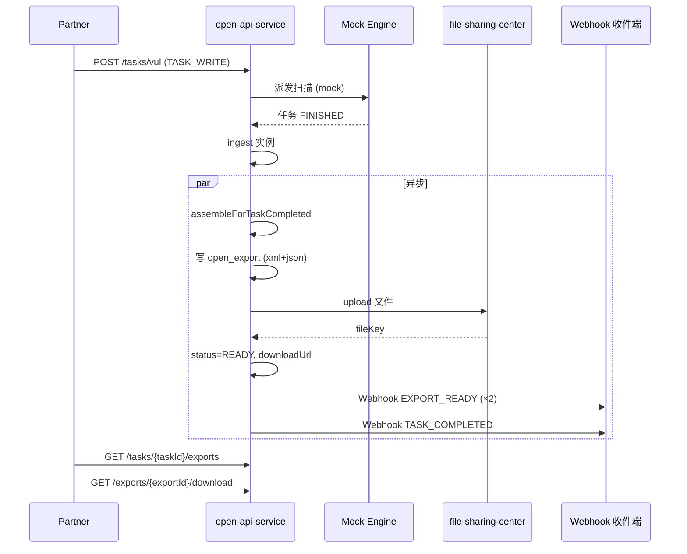
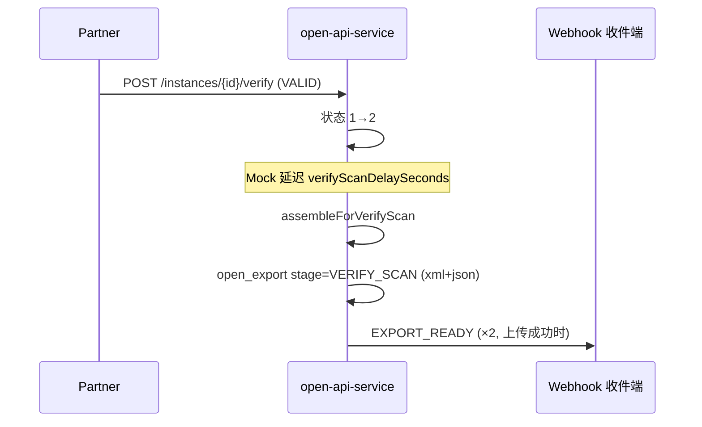
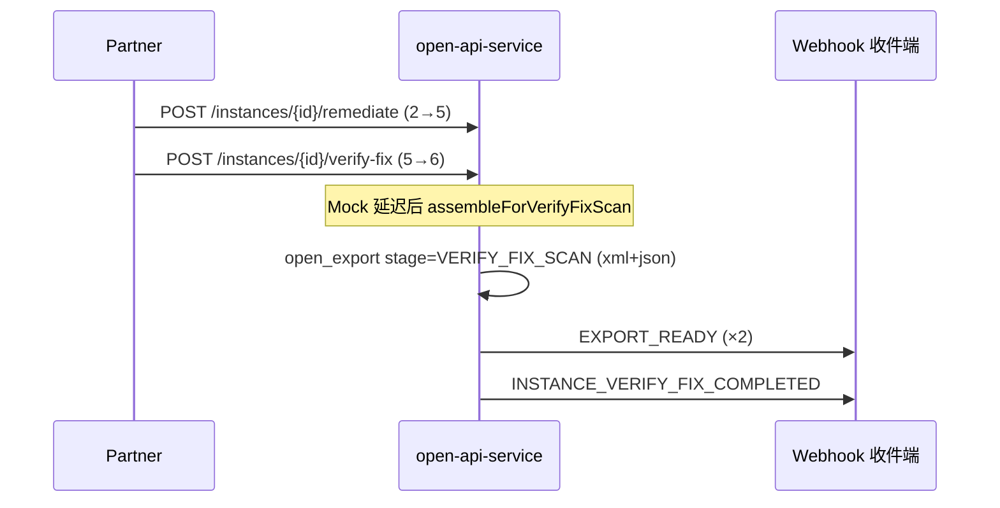
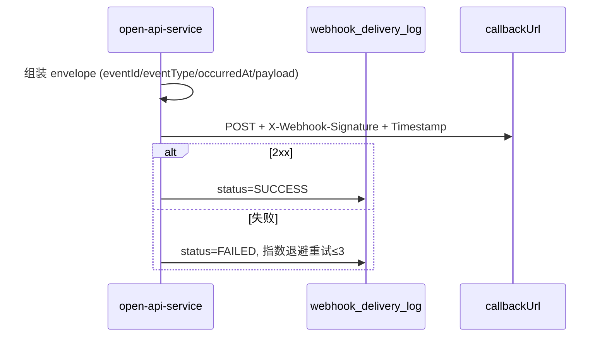

以下为 **open-api-service** 当前实现的架构线条、全量接口清单与测试矩阵（基于代码与 `api_operation` 种子数据）。

---

## 一、架构总览线条

```
Partner / E2E 脚本
    │
    ├─[Bearer + X-Partner-Id]──► /api/open/v1/**  (开放平台 Partner API)
    │
    ├─[X-Internal-Admin-Key]───► /internal/admin/**  (运营治理)
    │
    └─[无鉴权]──────────────────► /internal/health
                                   /internal/dev/webhook/receive  (联调收件)
                                   /oauth/token
```

```
open-api-service 内部主链路
┌─────────────┐    ┌──────────────┐    ┌─────────────────┐    ┌──────────────┐
│ Open*UI     │───►│ AppService   │───►│ DomainService   │───►│ Repository   │
│ (REST)      │    │ + Pipeline   │    │ + Event/Async   │    │ + Mapper/PO  │
└─────────────┘    └──────────────┘    └─────────────────┘    └──────────────┘
                                              │
                    ┌─────────────────────────┼─────────────────────────┐
                    ▼                         ▼                         ▼
              mock engine              file-sharing-center         Partner callbackUrl
              (scanTemplate)           (Feign upload)              (Webhook POST)
```

---

## 二、业务线条（Mermaid）

### 2.1 任务创建 → 完成 → 外发 + Webhook



### 2.2 核验 verify → VERIFY_SCAN 外发



### 2.3 修复核验 verify-fix → VERIFY_FIX_SCAN + Webhook



### 2.4 Webhook 出站投递线条



### 2.5 实例状态机线条（E2E 主路径）

```
stat=1 待验证
  ├─ verify VALID ──────────────► stat=2 已验证
  │                                 ├─ remediate ──► stat=5 修复中
  │                                 │                  └─ verify-fix FIX_CONFIRMED ──► stat=6
  │                                 └─ (触发 VERIFY_SCAN 外发)
  └─ verify FALSE_POSITIVE ─────► stat=3 误报 (不可 remediate)
```

---

## 三、全部接口清单

**Base URL（本地）**：`http://127.0.0.1:35780`  
**Partner 鉴权**：`Authorization: Bearer {token}` + `X-Partner-Id`  
**Admin 鉴权**：`X-Internal-Admin-Key`

### 3.1 开放平台 Partner API（`/api/open/v1`）

| #    | operationId            | 方法 | 路径                                            | 能力码              | 状态         | 说明                                            |
| ---- | ---------------------- | ---- | ----------------------------------------------- | ------------------- | ------------ | ----------------------------------------------- |
| 1    | issuePartnerToken      | POST | `/oauth/token`                                  | NONE                | ✅            | 获取 Token（亦支持 `/api/open/v1/oauth/token`） |
| 2    | createTaskByJson       | POST | `/api/open/v1/tasks/vul`                        | TASK_WRITE          | ✅            | JSON 创建任务                                   |
| 3    | createTaskByFile       | POST | `/api/open/v1/tasks/file`                       | TASK_WRITE          | ✅            | XML 字符串创建                                  |
| 4    | createTaskByUpload     | POST | `/api/open/v1/tasks/upload`                     | TASK_WRITE          | ✅            | multipart 上传 XML                              |
| 5    | listTasks              | GET  | `/api/open/v1/tasks`                            | TASK_READ           | ✅            | 任务列表（extTaskId 等过滤）                    |
| 6    | getTask                | GET  | `/api/open/v1/tasks/{taskId}`                   | TASK_READ           | ✅            | 任务进度                                        |
| 7    | searchInstances        | POST | `/api/open/v1/instances/search`                 | INSTANCE_READ       | ✅            | 实例搜索                                        |
| 8    | getInstance            | GET  | `/api/open/v1/instances/{vulInfoID}`            | INSTANCE_READ       | ✅            | 实例详情                                        |
| 9    | verifyInstance         | POST | `/api/open/v1/instances/{vulInfoID}/verify`     | INSTANCE_VERIFY     | ✅            | 单条核验（幂等）                                |
| 10   | verifyInstanceBatch    | POST | `/api/open/v1/instances/verify:batch`           | INSTANCE_VERIFY     | ✅            | 批量核验                                        |
| 11   | remediateInstance      | POST | `/api/open/v1/instances/{vulInfoID}/remediate`  | INSTANCE_REMEDIATE  | ✅            | 单条修复                                        |
| 12   | remediateInstanceBatch | POST | `/api/open/v1/instances/remediate:batch`        | INSTANCE_REMEDIATE  | ✅            | 批量修复                                        |
| 13   | verifyFixInstance      | POST | `/api/open/v1/instances/{vulInfoID}/verify-fix` | INSTANCE_VERIFY_FIX | ✅            | 单条修复核验                                    |
| 14   | verifyFixInstanceBatch | POST | `/api/open/v1/instances/verify-fix:batch`       | INSTANCE_VERIFY_FIX | ✅            | 批量修复核验                                    |
| 15   | getExport              | GET  | `/api/open/v1/exports/{exportId}`               | EXPORT_READ         | ✅            | 外发元数据                                      |
| 16   | downloadExport         | GET  | `/api/open/v1/exports/{exportId}/download`      | EXPORT_READ         | ✅            | 下载外发文件流                                  |
| 17   | listTaskExports        | GET  | `/api/open/v1/tasks/{taskId}/exports`           | EXPORT_READ         | ✅            | 任务下外发列表                                  |
| 18   | createTask             | POST | `/api/open/v1/tasks`                            | TASK_WRITE          | ⚠️ DEPRECATED | 目录有、Controller 无                           |
| 19   | archiveInstance        | POST | `/api/open/v1/instances/{vulInfoID}/archive`    | INSTANCE_ARCHIVE    | ❌            | 目录有、REST 未实现                             |
| 20   | archiveInstanceLegacy  | POST | `.../unfixable-records`                         | INSTANCE_ARCHIVE    | ⚠️ DEPRECATED | 未实现                                          |
| 21   | receivePlatformWebhook | POST | `{partnerCallbackUrl}`                          | EVENT_SUBSCRIBE     | 🔵 Partner 侧 | 平台出站，Partner 实现                          |

### 3.2 内部治理 / 联调 API

| #    | 方法   | 路径                                        | 鉴权      | 说明                  |
| ---- | ------ | ------------------------------------------- | --------- | --------------------- |
| 22   | GET    | `/internal/health`                          | 无        | 健康检查              |
| 23   | POST   | `/internal/token/introspect`                | 内网      | Token 自省            |
| 24   | POST   | `/internal/admin/partners`                  | Admin Key | 创建 Partner          |
| 25   | GET    | `/internal/admin/partners`                  | Admin Key | Partner 列表          |
| 26   | GET    | `/internal/admin/partners/{id}`             | Admin Key | Partner 详情          |
| 27   | PUT    | `/internal/admin/partners/{id}`             | Admin Key | 更新 Partner          |
| 28   | POST   | `/internal/admin/partners/{id}/credentials` | Admin Key | 签发 clientId/secret  |
| 29   | GET    | `/internal/admin/partners/{id}/credentials` | Admin Key | 凭证列表              |
| 30   | GET    | `/internal/admin/partners/{id}/stats`       | Admin Key | 调用统计              |
| 31   | GET    | `/internal/admin/api-operations`            | Admin Key | API 目录（21 条）     |
| 32   | GET    | `/internal/admin/invocations`               | Admin Key | 调用记录              |
| 33   | GET    | `/internal/admin/webhook-deliveries`        | Admin Key | Webhook 投递日志      |
| 34   | GET    | `/internal/admin/quotas`                    | Admin Key | Partner 配额          |
| 35   | POST   | `/internal/dev/webhook/receive`             | 无        | **联调 Webhook 收件** |
| 36   | GET    | `/internal/admin/webhook-test/inbox`        | Admin Key | 查看测试收件箱        |
| 37   | DELETE | `/internal/admin/webhook-test/inbox`        | Admin Key | 清空测试收件箱        |

### 3.3 Webhook 事件类型（出站）

| eventType                       | 触发时机                         | 典型 payload 关键字段                      |
| ------------------------------- | -------------------------------- | ------------------------------------------ |
| `TASK_COMPLETED`                | 任务 FINISHED + ingest 完成      | taskId, extTaskId                          |
| `TASK_FAILED`                   | 任务 FAILED                      | taskId, errorMessage                       |
| `EXPORT_READY`                  | 每个外发文件 READY（每格式一条） | exportId, format, exportStage, downloadUrl |
| `INSTANCE_VERIFY_FIX_COMPLETED` | verify-fix 扫描外发完成          | verifyFixJobId, items[]                    |

### 3.4 外发阶段（exportStage × format）

| exportStage       | 触发                    | 格式       | UK                             |
| ----------------- | ----------------------- | ---------- | ------------------------------ |
| `TASK_COMPLETED`  | 任务完成 ingest         | xml + json | (partner, task, stage, format) |
| `VERIFY_SCAN`     | verify 后 Mock 延迟     | xml + json | 同上                           |
| `VERIFY_FIX_SCAN` | verify-fix 后 Mock 延迟 | xml + json | 同上                           |

---

## 四、测试矩阵

### 4.1 脚本与入口

| 脚本                               | 用途                 | 命令                                                   |
| ---------------------------------- | -------------------- | ------------------------------------------------------ |
| `e2e-full-flow.ps1`                | 全量 E2E（推荐）     | `powershell -File e2e-full-flow.ps1 -ExportWaitSec 60` |
| `e2e-mock-flow.ps1`                | Mock 轻量流          | `powershell -File e2e-mock-flow.ps1`                   |
| `curl-partner-auth.sh`             | Token / Partner 鉴权 | `BASE=http://127.0.0.1:35780 ./curl-partner-auth.sh`   |
| `curl-verify.sh`                   | 核验接口快测         | 同上                                                   |
| `verify-open-api-ddd.ps1 -Compile` | DDD + 编译           | 改代码后必跑                                           |

### 4.2 E2E 分阶段测试矩阵（`e2e-full-flow.ps1`）

| Phase | 场景                | 覆盖接口/事件                                                | 断言要点                                       | 前置                        |
| ----- | ------------------- | ------------------------------------------------------------ | ---------------------------------------------- | --------------------------- |
| 0     | 健康检查            | `GET /internal/health`                                       | status=UP                                      | 服务启动                    |
| 1     | Partner 治理        | admin partners CRUD + credentials + stats + api-operations   | code=0                                         | Admin Key                   |
| 2     | 鉴权                | `POST /oauth/token`, introspect                              | token 可用                                     | Phase 1                     |
| 3     | 任务创建            | vul / file / upload / 幂等 extTaskId                         | FINISHED, 实例数                               | mock engine                 |
| 4     | 任务读              | getTask, listTasks                                           | 过滤 extTaskId                                 | Phase 3                     |
| 4.5   | 外发 TASK_COMPLETED | listTaskExports, getExport, download                         | xml+json READY, downloadUrl                    | **file-sharing-center**     |
| 5     | 实例状态机          | search, get, verify, remediate, verify-fix                   | 1→2→5→6; VERIFY_SCAN/VERIFY_FIX_SCAN 外发      | mock 延迟                   |
| 6     | 批量写              | verify/remediate/verify-fix batch                            | code=0                                         | Phase 5                     |
| 7     | 负向/隔离           | 幂等重放、冲突、误报不可修复、缺 Partner、跨 Partner task/export | 40001/40002/40003/40901                        | Partner B                   |
| 8     | 治理 + Webhook      | invocations, webhook-deliveries, quotas                      | TASK_COMPLETED≥1, EXPORT_READY≥2, VERIFY_FIX≥1 | defaultCallbackUrl→内置收件 |
| 9     | 目录未实现          | legacy createTask, archive, receivePlatformWebhook           | SKIP                                           | —                           |

### 4.3 功能 × 接口 × 自动化覆盖

| 功能域           | 关键接口                               | E2E                  | 手工/条件                                              |
| ---------------- | -------------------------------------- | -------------------- | ------------------------------------------------------ |
| 认证             | `/oauth/token`                         | ✅ Phase 2            | —                                                      |
| 任务写           | `/tasks/vul`, `/file`, `/upload`       | ✅ Phase 3            | upload 需 curl.exe                                     |
| 任务读           | `/tasks`, `/tasks/{id}`                | ✅ Phase 4            | —                                                      |
| 实例读           | `/instances/search`, `/instances/{id}` | ✅ Phase 5            | —                                                      |
| 实例写           | verify/remediate/verify-fix (+batch)   | ✅ Phase 5–6          | —                                                      |
| 幂等             | Idempotency-Key                        | ✅ Phase 7            | —                                                      |
| 外发读           | exports 三接口                         | ✅ Phase 4.5/5        | 依赖 file-sharing                                      |
| Webhook 出站     | 投递日志 + 内置收件                    | ✅ Phase 8            | callbackUrl 默认 `{Base}/internal/dev/webhook/receive` |
| Webhook 收件验签 | signatureValid                         | ⚠️                    | 需配置 webhookSecret                                   |
| 备案 archive     | `/instances/{id}/archive`              | ❌ SKIP               | 待实现                                                 |
| 重任务 500+ 实例 | scanTemplateId=1001                    | 可选 `-IncludeHeavy` | 耗时长                                                 |

### 4.4 联调检查清单（最小 PASS 路径）

```
1. 重启 open-api-service（Liquibase DDL 已应用）
2. file-sharing-center 可用（否则外发 SKIP/FAILED）
3. 创建 Partner：defaultCallbackUrl = http://127.0.0.1:35780/internal/dev/webhook/receive
4. powershell -File e2e-full-flow.ps1 -ExportWaitSec 60
5. 验收：
   - GET /internal/admin/webhook-test/inbox → 有 TASK_COMPLETED / EXPORT_READY
   - GET /tasks/{id}/exports → TASK_COMPLETED xml+json status=READY
   - GET /internal/admin/webhook-deliveries → httpStatus=200, status=SUCCESS
```

### 4.5 常见 FAIL → 原因

| 现象                 | 可能原因                                                     |
| -------------------- | ------------------------------------------------------------ |
| 外发无 READY         | file-sharing-center 不可用 / 服务未重启                      |
| EXPORT_READY count=0 | 外发 FAILED（上传失败则不发 EXPORT_READY）                   |
| Webhook 投递 FAILED  | callbackUrl 不可达（用内置 `/internal/dev/webhook/receive`） |
| ConvertHelper 报错   | 缺 DomainConvertor（OpenExport 已补）                        |
| 分页 WARN `format`   | OpenExportPO `@TableField("\`format\`")` 已修                |

---

## 五、能力码一览（Partner capabilities）

| 能力码                 | 用途                                    |
| ---------------------- | --------------------------------------- |
| TASK_READ / TASK_WRITE | 任务读写                                |
| INSTANCE_READ          | 实例查询                                |
| INSTANCE_VERIFY        | 核验                                    |
| INSTANCE_REMEDIATE     | 修复                                    |
| INSTANCE_VERIFY_FIX    | 修复核验                                |
| INSTANCE_ARCHIVE       | 备案（接口待实现）                      |
| EXPORT_READ            | 外发查询/下载                           |
| EVENT_SUBSCRIBE        | Webhook 订阅（出站侧校验 Partner 配置） |

---

如需我把以上内容落成仓库内文档（例如 `svmp/docs/internal/open-api-interface-test-matrix.md`），可以说一声我直接写入。