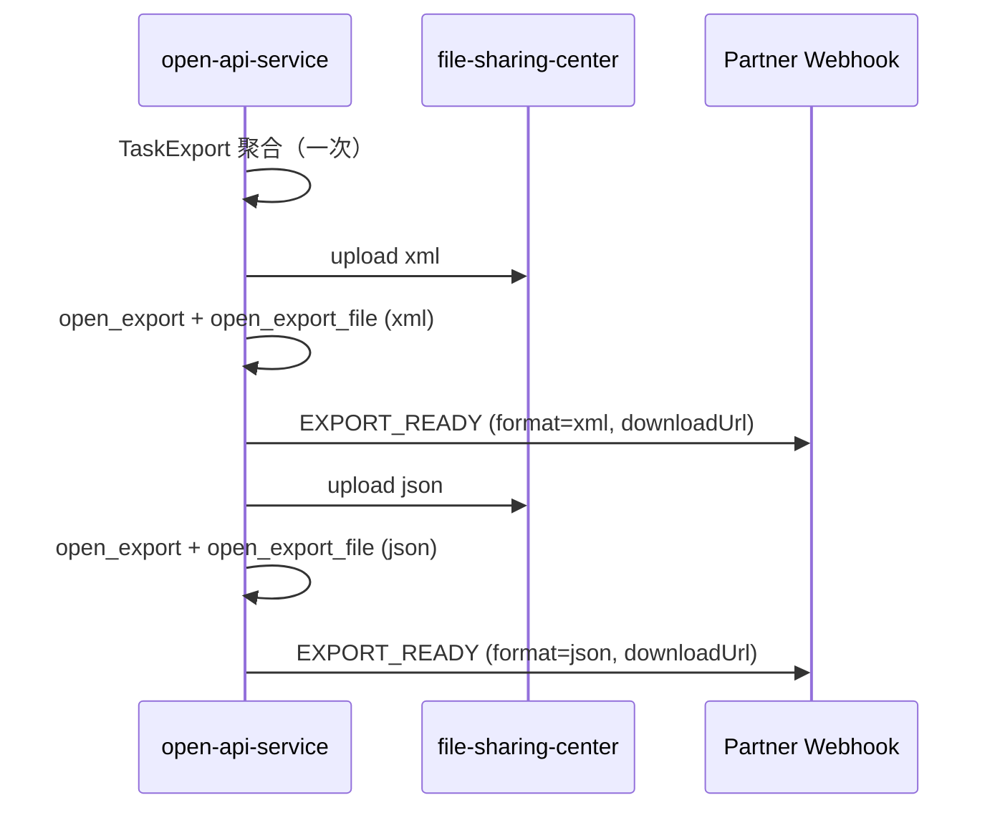

# 开放平台 · 外发（§5.6/§7）+ Webhook（§6）产品需求文档（PRD）

> **用途**：Multi-Agent / 全自动开发编排输入。任务矩阵见 `features/open-platform-openapi-p2.yaml`；Webhook 出站接通见分期方案 **P1-d**。
>
> **状态**：`草稿` | 待用户回复「同意执行」后派 Agent 编码

| 属性 | 值 |
|------|-----|
| 功能编号 | **OP-OPENAPI-P1-d + OP-OPENAPI-P2** |
| 模块名称 | 扫描结果外发 + 事件回调出站 |
| 目标阶段 | P1-d（Webhook 接通）+ P2（外发全链路） |
| 主工程 | `open-api-service`（执行面）、`partner-gateway`（EXPORT_READ 能力） |
| 依赖 | OP-MOCK-P1-DB（实例落库）?、OP-OPENAPI-P1-a~c（实例读写）? |
| 契约源 | API 接口文档 §5.6、§6、§7；`openapi/v1/openapi.yaml` |
| 文件服务参考 | `vuln-model` · `vul_scan_task_file` + `AbstractVulReportEvent` + `IFileServiceFeign` |

---

## 0. 已确认产品决策

| # | 议题 | **结论** |
|---|------|----------|
| D-01 | 任务完成外发格式 | **同时生成 `xml` + `json` 两条 `open_export`**，各自独立 `exportId`，各发一条 `EXPORT_READY` Webhook |
| D-02 | 文件存储表结构 | **新增 `open_export_file`**，字段语义对齐 `vul_scan_task_file`（`file_position` / `file_field` / `file_metadata` / `file_type` / `real_task_id`） |
| D-03 | `downloadUrl` | **本期必填**，返回 **file-sharing-center 完整可下载 URL**（非开放平台相对路径），用于 §6.5 `EXPORT_READY` payload |
| D-04 | `VERIFY_SCAN` 阶段 | **Mock 实现**：`verify` 后延迟触发 `VERIFY_SCAN` 双格式外发 |
| D-05 | `open_task.report_template_id` | **加列**；创建任务时写入 |

---

## 1. Why — 背景与目标

### 1.1 背景

当前 `open-api-service` 已完成 §5.1 任务、§5.2–5.5 实例（含 Mock MySQL 落库），E2E 全量脚本 **37 PASS**。但接入方完整联调链路仍缺：

| 能力 | 现状 | 缺口 |
|------|------|------|
| §6 Webhook | `WebhookDomainServiceImpl.deliver()` 已实现投递、重试、写 `webhook_delivery_log` | **无 `@EventListener` 调用**；发布的是非契约 `INSTANCE_STATUS_CHANGED`；缺四种契约事件 |
| §5.6 / §7 外发 | `open_export` 仅有 Liquibase DDL | **无 Domain / Controller / 组装器**；文件未上传文件服务器 |
| 文件存储 | vuln-model：`vul_scan_task_file` + Feign 上传 | open-api-service **未引入** 同等模式 |

接入方典型流程（API §10）：创建任务 → `TASK_COMPLETED` → **两条** `EXPORT_READY`（xml/json）→ 用 `downloadUrl` 或 `GET /exports/{exportId}/download` 拉取 `TaskExport`。

### 1.2 目标

1. **Webhook 出站**与 API §6 完全一致（含 `EXPORT_READY.downloadUrl` 完整 URL）。
2. **TaskExport 规范化组装**，任务完成 **同时** 产出 xml、json 两个外发记录。
3. 文件落 **file-sharing-center**，元数据按 **`vul_scan_task_file` 模式** 写入 `open_export_file`。
4. Mock 环境可端到端验收。

### 1.3 成功标准

| 指标 | 标准 |
|------|------|
| 双格式外发 | 单次 `TASK_COMPLETED` 后 `open_export` 新增 **2 行**（`format=xml` / `format=json`），`uk` 维度 `(task_id, export_stage, format)` 幂等 |
| Webhook | 对应 **2 条** `EXPORT_READY`，payload.`downloadUrl` 为完整 HTTP URL，浏览器/curl 可直接下载 |
| `downloadUrl` 形态 | 与线上一致：`{publicBaseUrl}/file-sharing-center/file-sharing/download?bucket={bucket}&fileKey={urlEncode(fileKey)}&_username={username}` |
| 文件表 | 每条 READY 外发在 `open_export_file` 有记录，`file_position`+`file_field` 可 `readBytes` 还原 |
| Partner 隔离 | 跨 Partner 查/下 export → `40003` |

### 1.4 不做边界

- 不做 Partner 侧 Webhook 接收端示例服务
- 不做 vul-pass 真实外发数据源（Mock 先行）
- 不写入 vuln-model 库表 `vul_scan_task_file`（开放平台独立 `open_export_file`，仅复用字段语义与 Feign 协议）
- 不做 EXPORT 运营大页面

---

## 2. Who — 角色与用户

| 角色 | 说明 | 核心操作 |
|------|------|----------|
| 接入方开发者 | 调用 Open API | 收 Webhook、用 `downloadUrl` 或 REST 下载 |
| 平台联调工程师 | Mock 环境 | 验证双格式、URL 可达、条数 |
| 运营管理员 | 集成管理后台 | 配置 callbackUrl / Webhook Secret |

---

## 3. What — 功能范围

### 3.1 用户故事（增补）

| ID | 行为者 | 我希望… | 以便… |
|----|-------|---------|-------|
| US-E04 | 接入方 | 任务完成后同时收到 xml、json 两条 `EXPORT_READY` | 按己方系统偏好选格式，无需二次转换 |
| US-E05 | 接入方 | `downloadUrl` 直接指向文件服务器 | 绕过开放平台代理，大文件下载更稳 |
| US-O03 | 联调工程师 | `open_export_file` 与 vuln-model 报告文件字段一致 | 复用运维排障经验 |

### 3.2 外发 REST（§5.6.8–5.6.10）

| 方法 | 路径 | 说明 |
|------|------|------|
| GET | `/exports/{exportId}` | 元数据；**含完整 `downloadUrl`** |
| GET | `/exports/{exportId}/download` | 文件流（代理 `readBytes` 或 302 至 `downloadUrl`，实现期二选一，默认代理流式） |
| GET | `/tasks/{taskId}/exports` | 分页；单任务 `TASK_COMPLETED` 至少 **2 条**（xml + json） |

### 3.3 双格式生成规则

| 触发 | exportStage | 生成记录 |
|------|-------------|----------|
| 任务 FINISHED + ingest 完成 | `TASK_COMPLETED` | **固定 2 条**：`format=xml`、`format=json`（相同 `export_stage` / `data_type` / `record_count`，不同 `export_id`） |
| 修复核验复扫完成 | `VERIFY_FIX_SCAN` | 同上，再生成 xml + json 各 1 条 |
| 验证复扫完成（若实现） | `VERIFY_SCAN` | 同上 |

**组装优化**：同一阶段先构建内存中 `TaskExport` 对象一次，再分别序列化为 xml、json 上传，避免重复查库聚合。

**Webhook**：每行 `open_export` 进入 `READY` 后各发 **1 条** `EXPORT_READY`（任务完成最多连续 2 条外发 Webhook）。

### 3.4 Webhook `EXPORT_READY` payload（§6.5）

```json
{
  "eventId": "evt-20260613-0002-xml",
  "eventType": "EXPORT_READY",
  "occurredAt": "2026-06-13T08:05:00Z",
  "partnerId": "partner-demo-01",
  "payload": {
    "exportId": "EXP-20260613-7f3a-xml",
    "taskId": "TASK-7f3a2b1c",
    "extTaskId": "EXT-TASK-2026-0001",
    "reportTemplateId": 2001,
    "format": "xml",
    "exportStage": "TASK_COMPLETED",
    "dataType": "MIXED",
    "recordCount": 128,
    "downloadUrl": "http://172.16.4.192/file-sharing-center/file-sharing/download?bucket=open-api-service&fileKey=export-TASK-7f3a2b1c-EXP-20260613-7f3a-xml.xml&_username=admin"
  }
}
```

`json` 格式记录的 `format` 为 `json`，`fileKey` 后缀 `.json`，`downloadUrl` 中 `fileKey` 做 **URL 编码**（中文文件名与 vuln-model 报告 zip 一致，如 `%25E6%25BC%258F...`）。

---

## 4. How — 技术方案

### 4.1 总体架构

```text
Task FINISHED
    │
    ├─? TASK_COMPLETED Webhook（1 条）
    │
    └─? ExportAssemblyDomainService
            ├─ TaskExportAssembler（聚合一次）
            ├─ serialize → xml bytes / json bytes
            ├─ IFileServiceFeign.upload(bucket, file)  ×2
            ├─ open_export（2 行：xml + json）
            ├─ open_export_file（2 行，对齐 vul_scan_task_file）
            ├─ 生成 downloadUrl ×2
            └─ EXPORT_READY Webhook ×2
```

### 4.2 文件服务器与 `downloadUrl` 生成

#### 4.2.1 上传（对齐 `AbstractVulReportEvent`）

| 项 | 约定 |
|----|------|
| Feign | `IFileServiceFeign.upload(bucket, VtcMultipartFile)` |
| bucket | `file_position` = `${spring.application.name}`（如 `open-api-service`；与 vuln-model 用 `vuln-model` 同理） |
| fileKey | `file_field` = Feign 返回 key；命名 `export-{taskId}-{exportId}.xml` / `.json` |
| file_metadata | 原始展示名，写入 `open_export_file.file_metadata` |

#### 4.2.2 `downloadUrl` 拼接规则

**接口路径**（经 Nginx 反代）：`GET /file-sharing-center/file-sharing/download`

**完整 URL 模板**：

```text
{open-api.file-sharing.public-base-url}/file-sharing-center/file-sharing/download
  ?bucket={urlEncode(file_position)}
  &fileKey={urlEncode(file_field)}
  &_username={urlEncode(open-api.file-sharing.download-username)}
```

**示例**（与用户环境一致）：

```text
http://172.16.4.192/file-sharing-center/file-sharing/download?bucket=open-api-service&fileKey=export-TASK-xxx-EXP-yyy.xml&_username=admin
```

**配置项**：

| 配置键 | 示例 | 说明 |
|--------|------|------|
| `open-api.file-sharing.public-base-url` | `http://172.16.4.192` | 不含尾斜杠；Partner 可达的网关/主机地址 |
| `open-api.file-sharing.download-username` | `admin` | 追加至 query `_username`，与现有 file-sharing 下载鉴权一致 |

**落库**：`open_export.download_url` 冗余存储完整 URL，API 与 Webhook 直接返回，避免每次拼接。

**实现类**：`ExportDownloadUrlBuilder`（单测覆盖编码与中文 fileKey）。

### 4.3 数据模型

#### 4.3.1 `open_export`（外发业务元数据）

在现有 DDL 上扩展：

| 字段 | 类型 | 说明 |
|------|------|------|
| `ext_task_id` | VARCHAR(128) | Partner 幂等键 |
| `report_template_id` | INT | 报告模板 |
| `export_stage` | VARCHAR(32) | `TASK_COMPLETED` / `VERIFY_SCAN` / `VERIFY_FIX_SCAN` |
| `data_type` | VARCHAR(32) | `MIXED` / `SYSTEM_VULNERABILITY` / … |
| `generated_at` | DATETIME | 生成时间 |
| `download_url` | VARCHAR(1024) | **完整 file-sharing 下载 URL** |
| `error_message` | VARCHAR(1024) | FAILED 原因 |
| `verify_fix_job_id` | VARCHAR(64) | 阶段外发关联 |
| `updated_at` | DATETIME | |

**不再在 `open_export` 存 `file_position` / `file_field`**（下沉至 `open_export_file`）。

**幂等唯一约束**：`uk_open_export_task_stage_format` on `(partner_id, task_id, export_stage, format)`。

**`storage_path`**：废弃写入；历史列保留兼容。

#### 4.3.2 `open_export_file`（新建，对齐 `vul_scan_task_file`）

参考 `vuln-model/.../db/mysql/vul_scan_task_file.groovy`：

| 字段 | 类型 | 说明 |
|------|------|------|
| `id` | BIGINT PK AI | 主键 |
| `export_id` | VARCHAR(64) | 关联 `open_export.export_id`，**UK** |
| `real_task_id` | VARCHAR(64) | 平台 `open_task.task_id`（同 `vul_scan_task_file.real_task_id` 语义） |
| `partner_id` | VARCHAR(64) | Partner 隔离 |
| `file_position` | VARCHAR(255) | bucket |
| `file_field` | VARCHAR(255) | fileKey |
| `file_metadata` | VARCHAR(255) | 展示名 / 备注 |
| `file_type` | INT | 开放平台外发类型：**`11`=外发 XML，`12`=外发 JSON**（与 vuln-model 1–4 错开） |
| `create_time` | DATETIME | 默认 CURRENT_TIMESTAMP |
| `update_time` | DATETIME | 可选 |

**关系**：`open_export` 1 : 1 `open_export_file`。

**写入时机**：Feign 上传成功后同事务写入 `open_export`（READY）+ `open_export_file`。

#### 4.3.3 与 `vul_scan_task_file` 对照

| vul_scan_task_file | open_export_file |
|--------------------|------------------|
| `real_task_id` | `real_task_id` |
| `file_position` | `file_position` |
| `file_field` | `file_field` |
| `file_metadata` | `file_metadata` |
| `file_type` 1–4 | `file_type` **11/12** |
| （无 export 概念） | `export_id` + `partner_id` |

#### 4.3.4 其他表

- `open_task`：建议增 `report_template_id`（待 D-05）
- `webhook_delivery_log`：可选增 `event_id`

### 4.4 Webhook

- 载荷结构见 §0 / 原 PRD §4.4（`occurredAt` + `payload`）
- `EXPORT_READY.payload.downloadUrl` **必须**为 §4.2.2 完整 URL
- 任务完成：**先** `TASK_COMPLETED`，**再** 两条 `EXPORT_READY`（xml 然后 json，或并行，顺序不保证但 eventId 不同）

### 4.5 TaskExport 组装

（与原 PRD 一致：`MockTaskExportAssembler` 读 `open_task` + `open_vuln_instance` + bundle；`recordCount` = 实例总数。）

### 4.6 配置项汇总

| 配置键 | 默认 | 说明 |
|--------|------|------|
| `open-api.export.enabled` | `true` | 外发总开关 |
| `open-api.export.formats` | `xml,json` | 每阶段生成的格式列表（本期固定双格式） |
| `open-api.export.ttl-days` | `7` | `expires_at` |
| `open-api.export.async` | `true` | 异步组装 |
| `open-api.file-sharing.public-base-url` | （环境必填） | downloadUrl 主机 |
| `open-api.file-sharing.download-username` | `admin` | `_username` 参数 |
| `vtc.application.name.file` | `file-sharing-center` | Feign 服务名 |

### 4.7 Partner Gateway

- `/api/open/v1/exports/**` → `EXPORT_READ`
- **说明**：Partner 也可 **不经过 gateway**，直接用 Webhook 中的 `downloadUrl` 访问 file-sharing（需网络可达与 `_username` 鉴权策略允许）

---

## 5. 验收标准（增补/修订）

| 编号 | 场景 | 预期 |
|------|------|------|
| AC-W02 | 任务完成外发 | `webhook_delivery_log` 含 **2 条** `EXPORT_READY`（xml、json）；`downloadUrl` 以 `http` 开头且含 `/file-sharing-center/file-sharing/download` |
| AC-W06 | downloadUrl 可达 | curl `downloadUrl` 返回 200 与外发文件内容一致 |
| AC-E01 | GET export 元数据 | 含 `downloadUrl` 完整 URL |
| AC-E04 | GET task exports | `TASK_COMPLETED` 下 `items.length >= 2`，`format` 分别为 xml、json |
| AC-E07 | open_export_file | 每 export 一行；`file_position`/`file_field` 与 URL 中 bucket/fileKey 一致 |
| AC-E10 | fileKey 中文名 | URL 中 fileKey 正确百分号编码 |

---

## 6. 里程碑

| 阶段 | 内容 | 工期 |
|------|------|------|
| M1 | `open_export` 扩展 + **`open_export_file` 建表** + Feign + `ExportDownloadUrlBuilder` | 1–2d |
| M2 | Webhook EventListener + 载荷修正 | 1–2d |
| M3 | 双格式组装上传 + 双 EXPORT_READY | 2–3d |
| M4 | OpenExportUI 三接口 | 1–2d |
| M5 | Gateway + E2E | 1–2d |

---

## 7. 风险

| 项 | 说明 | 缓解 |
|----|------|------|
| Partner 网络无法访问 file-sharing 内网 IP | `downloadUrl` 在外网不可用 | 文档说明需 VPN/专线；REST `/download` 仍作网关代理兜底 |
| `_username=admin` 权限 | 与现有报告下载一致 | 配置化；后期可改 Partner 级服务账号 |
| 双 Webhook 风暴 | 单任务 2 条 EXPORT_READY | 契约要求；Partner 按 `exportId` 幂等 |

---

## 8. 附录

### 8.1 DDL 草案

**`open_export` 扩展**：

```groovy
changeSet(id: '2026-06-13-extend-open_export-metadata', author: 'open-api') {
    addColumn(tableName: 'open_export') {
        column(name: 'ext_task_id', type: 'VARCHAR(128)')
        column(name: 'report_template_id', type: 'INT')
        column(name: 'export_stage', type: 'VARCHAR(32)')
        column(name: 'data_type', type: 'VARCHAR(32)')
        column(name: 'generated_at', type: 'DATETIME')
        column(name: 'download_url', type: 'VARCHAR(1024)', remarks: 'file-sharing 完整下载 URL')
        column(name: 'error_message', type: 'VARCHAR(1024)')
        column(name: 'verify_fix_job_id', type: 'VARCHAR(64)')
        column(name: 'updated_at', type: 'DATETIME')
    }
    addUniqueConstraint(tableName: 'open_export',
        columnNames: 'partner_id, task_id, export_stage, format',
        constraintName: 'uk_open_export_task_stage_format')
}
```

**`open_export_file` 新建**：

```groovy
changeSet(id: '2026-06-13-create-table-open_export_file', author: 'open-api') {
    createTable(tableName: 'open_export_file', remarks: '开放平台外发文件（对齐 vul_scan_task_file）') {
        column(name: 'id', type: 'BIGINT', autoIncrement: true) {
            constraints(primaryKey: true, primaryKeyName: 'pk_open_export_file')
        }
        column(name: 'export_id', type: 'VARCHAR(64)') { constraints(nullable: false) }
        column(name: 'real_task_id', type: 'VARCHAR(64)', remarks: 'open_task.task_id')
        column(name: 'partner_id', type: 'VARCHAR(64)') { constraints(nullable: false) }
        column(name: 'file_position', type: 'VARCHAR(255)', remarks: 'bucket')
        column(name: 'file_field', type: 'VARCHAR(255)', remarks: 'fileKey')
        column(name: 'file_metadata', type: 'VARCHAR(255)')
        column(name: 'file_type', type: 'INT', remarks: '11=外发XML 12=外发JSON')
        column(name: 'create_time', type: 'DATETIME', defaultValueComputed: 'CURRENT_TIMESTAMP')
        column(name: 'update_time', type: 'DATETIME')
    }
    addUniqueConstraint(tableName: 'open_export_file', columnNames: 'export_id',
        constraintName: 'uk_open_export_file_export_id')
    createIndex(tableName: 'open_export_file', indexName: 'idx_open_export_file_task') {
        column(name: 'real_task_id')
        column(name: 'partner_id')
    }
}
```

### 8.2 端到端时序（双格式）



### 8.3 参考路径

| 用途 | 路径 |
|------|------|
| 任务文件表 DDL | `vuln-model/.../db/mysql/vul_scan_task_file.groovy` |
| 上传实现 | `vuln-model/.../AbstractVulReportEvent.java` |
| 文件下载 API | `GET /file-sharing-center/file-sharing/download` |
| Webhook 投递 | `open-api-service/.../WebhookDomainServiceImpl.java` |

---

## 9. 联调说明

重启服务并跑 Liquibase 后，执行 e2e-full-flow.ps1 验证 export 三接口与 webhook_delivery_log。