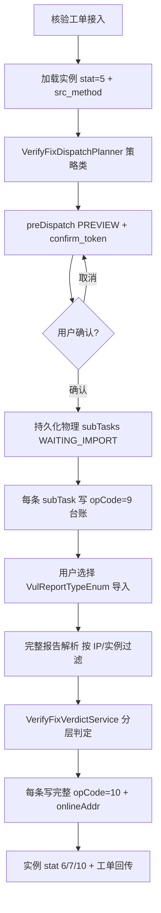

# 修复核验全链路（vul-pass）— 产品需求文档（PRD）

> **用途**：部侧考核合规改造与修复核验业务闭环的**唯一产品规格**；Multi-Agent 自动化开发的上游输入。  
> **状态**：`草稿` · **v1.4.4 工作台 UI 定稿规格（§7.5.7 改造事项）** · **v1.4.2 任务详情工作台交互定稿** · **v1.4.1 门闸编排落地缺陷修复（见 §18）**  
> **版本**：v1.4.4  
> **日期**：2026-07-16

| 属性 | 值 |
|------|-----|
| 功能编号 | **VULPASS-VERIFYFIX-P0** ~ **P3** |
| 模块名称 | 修复核验全链路（工单接入 → 编排预览 → 离线导入 → 判定 → 台账） |
| 主服务 | **`vul-pass`**（唯一业务执行面） |
| 前端工程 | **`asset-newleak-manage`**（qiankun 子应用） |
| 开发分支 | 两端统一 **`feature/fix-ledger-log-records`** |
| 关联服务 | `vuln-task-center`（在线扩展，本期默认离线）；`asset-other-manage`（BAS/等效防护，P2） |
| **明确不做** | **`open-api-service` 业务改造**（仅保留对外 API 薄层，能力后续 Feign 至 vul-pass） |
| 参考规范 | 《建设指南(2025)》《接口规范(2025)》《测试规范(2025)》；`svmp/docs/standards/` |
| 关联 PRD | `修复核验运营工作台-PRD.md`（open-api 运营面，与本 PRD 解耦） |
| 工程路径 | 后端 `project_backend/svmp/vul-pass`；前端 `project_frontend/asset/asset-newleak-manage` |

---

## 1. Why — 背景与目标

### 1.1 背景

工信部专项漏洞排查工单考核中，基于台账日志分析发现两类不合规项：

| 考核项 | 问题描述 |
|--------|----------|
| **排查 IP ↔ 台账** | 排查任务发现漏洞的资产 IP 未出现在台账日志 `onlineAddrFileLoc` 中 |
| **修复核验存活一致性** | 「漏洞核验方式与目标存活状态不匹配」；存活一致性比率未达标（要求 ≥80%） |

**建设指南核心要求（修复核验）：**

> 对于闭环漏洞需核实修复或已防护状态，并提供判定证据。  
> 支持记录修复方式；**对在线的已修复资产业务连通性检测**；  
> **补丁修复** → 登录扫描或远程版本扫描核验；  
> **等效防护或方式未知** → POC、BAS 攻击模拟验证安全效果。

**指南释义（v1.2）：**

- 「方式未知」**不等于** 1051–1053；指未登记修复方式的情形。本期**不实现**未知分支，空/`非105x` 拒绝进入编排。
- 指南**未逐条**规定 1052/1053 的检测手段；本期按修复语义默认 **仅连通性（expect_alive=false）**，属产品推断，需在设计说明中留痕。

当前 `vul-pass` 已有修复核验 BPMN、1060/1061、106 台账骨架、`preDispatch`；分支上已落地部分 P0/P1（DDL、Merger、confirmToken、**按阶段拆物理子任务的预览**）。v1.2 **纠偏**：物理子任务改为「扫描器语义」拆分（见 §4.2、§16）。

### 1.2 目标

1. **合规**：专项排查与修复核验回传后，排查 IP 覆盖与存活一致性达标。
2. **门闸 + 策略化**：**先 1028 连通性门闸**（主机存活+端口），再按实例 `src_method` 结案或二次技术核验。
3. **可确认**：预览后用户仅确认/取消；确认前不可下发（confirmToken）。
4. **离线优先**：`tsk_model=1`（0=在线，1=离线）；离线可用完整报告内生存活段**等价完成 Gate**（须可举证）。
- `logType`：1060（或 bas-enabled=true 时二次显式 1061）；`verify_src_method` / 内容 srcMethod 为真实 1028/1022/1027/1021

### 1.3 成功标准（可衡量）

| 指标 | 标准 | 验证方式 |
|------|------|----------|
| 排查 IP 覆盖率 | 专项工单 `vulNetAddr` ⊆ 台账 `onlineAddrFileLoc` | SQL / 台账查询 |
| 存活一致性比率 | `alive_consistent=true` 占比 **≥80%**（手段与存活场景匹配，见 §6.6） | 靶标 / ComplianceMetrics |
| 核验方式匹配率 | Gate=1028；1050 存活后再 1022/1027(配置项)；1051 存活后固定 1021 POC（BAS 1061 暂未落地）；禁止对不存活 1050/1051 做技术核验结论 | verify_src_method + 编排顺序 |
| 台账完整性 | 每条物理 subTask 一对 **9+10**，Gate 的 10 必含 `onlineAddrFileLoc` | logNum = subTask×2 |
| 混合工单 | 共用 Gate；1052/1053 Gate 后结案；1050/1051 仅存活进入二次 Scan | 联调 |

### 1.4 不做边界

- 不改造 `open-api-service` 修复核验编排/Job/Webhook。
- 不改 Partner `verify-fix` REST；不改部侧协议字段。
- **不引入「修复方式未知」分支**（仅 1050–1053）。
- 本期默认离线；在线 VTC 为 P3 可选。
- **禁止**将 PORT 拆成独立半截台账物理子任务（v1.1 废止）；**允许**「1028 Gate → 条件二次 Scan」两波物理任务（v1.4）。

---

## 2. Who — 角色与用户

| 角色 | 说明 | 核心操作 |
|------|------|----------|
| **部侧平台** | 下发核验工单（34/1063）、拉取台账与系统漏洞表 | 考核验收 |
| **漏管运营** | 处理本地 BPMN 修复核验节点或部侧工单 | 预览方案 → 确认 → 导入报告 → 提交 |
| **安全运维** | 维护安全资源设备（engHash/engType） | 保障扫描器/POC/BAS/连通性设备可用 |
| **研发/测试** | 联调靶标与生产 XLSX 路径 | 按验收用例回归 |

---

## 3. What — 功能范围

### 3.1 用户故事

| ID | 作为… | 我希望… | 以便… | 阶段 |
|----|-------|---------|-------|------|
| US-01 | 运营 | 收到修复核验工单后，系统自动解析待核验实例及各自 src_method | 不用手工分组 | P0 |
| US-02 | 运营 | 下发前看到「扫描器语义」子任务预览（策略类、设备、IP 批次、证据能力说明） | 确认无误再处置 | P1 |
| US-03 | 运营 | 确认后按建议模板导入 NSFOCUS XML 或平台 XLSX | 离线完成核验 | P1 |
| US-04 | 系统 | **Gate(1028)** 完成后再做 1050/1051 二次技术核验；1052/1053 Gate 即结案 | 堵住「方式与存活不匹配」 | P2′ |
| US-05 | 系统 | 按 src_method 判定 6/7/10（1052/1053：存活→7，不可达→6） | 闭环合规 | P2 |
| US-06 | 系统 | 每条物理 subTask 完整 9/10，Gate 必写 onlineAddr | 部侧审计通过 | P0 |
| US-07 | 运营 | 混合工单一次预览：Gate 批 + 条件二次 Scan 批 | 常见生产场景可用 | P1 |
| US-08 | 运营 | 主任务列表点行看摘要，全页查看子任务编排/结果/台账，子任务可去处置 | 核验过程可追踪、可操作 | P2′ |

### 3.2 入口与触发

| 入口 | 指令/节点 | 主任务 proc_method | 说明 |
|------|-----------|-------------------|------|
| 部侧核验工单 | `CommandSubType` **34** / 回传 **44** | 一般为 **1060** | `CommandListener` |
| 跨级联动核验 | **1063** | **1060** | 同上 |
| 本地 BPMN | `UserRiskRemReinvest6/7` | 1060 或工单指定 | 修复核验节点 |

### 3.3 实例加载规则

从工单 `vulInfoRange` / 指定 `vulInfoID` 加载：

```text
条件:
  vulInfoStat = 5（已修复）
  src_method IN (1050, 1051, 1052, 1053)

拒绝:
  src_method 为空或非 105x → 提示先完成修复处置并记录修复方式
  1050 无 fixLnk / 1051|1052 无 defDev → 校验失败（与处置阶段一致）
```

**术语**：本文 **src_method** 指实例修复阶段的源处置方式（1050–1053），与子任务核验 `proc_method`（1060/1061）区分。

---

## 4. 建设指南解读 — 证据链与执行单元

### 4.1 证据链与物理编排（v1.4 · 1028 门闸）

对准部侧考核「漏洞核验方式与目标存活状态不匹配」。跨级/本地工单技术处置方式外壳为 **1060（修复核验自适应扫描）** 时：

```text
【Wave-Gate】对工单影响资产做连通性检测（主机存活 + 端口扫描）
  · 实际手段 verify_src_method / 台账内层 srcMethod = 1028
  · 台账外壳 logType = 1060（格式同系统漏洞排查/弱口令；BAS 规范未下发前同此）
  · 必写 onlineAddrFileLoc（覆盖本批；支撑四元组匹配）
  · 可按 astUnitNum 对唯一 IP 切批；engType bit=16；可受 eng_hash_cnt 池约束

【分流】按实例修复史 src_method ∈ {1050,1051,1052,1053}：

  · 1052 / 1053（§4.3）
      探测目标仍存活(IP+端口+协议+服务) → vulInfoStat=7 核验未修复
      探测目标不可达               → vulInfoStat=6 核验修复
      无法判定                     → vulInfoStat=10
      Gate 完成后即结案，不进入二次技术扫描

  · 1050 / 1051 且目标不存活 → vulInfoStat=10 核验失败（禁止再发登录/版本/POC）

  · 1050 且存活 → 【Wave-Scan】手段 ∈ {1020,1022,1023,1024,1027}（默认 1027，工单可盖）
  · 1051 且存活 → 【Wave-Scan】手段 ∈ {1021, 1061}
```

> **与 v1.2/v1.3 差异**：连通性从「同报告逻辑前置」升级为 **可独立物理下发的 1028 Gate**；二次 Scan 资产集 ⊆ Gate 存活集。  
> **仍禁止**：把 PORT 拆成单独半截台账子任务；Gate/Scan 各自必须是完整 9+10。

离线导入：若运营一次导入含存活+漏洞的完整 XML，可用报告内生存活段 **等价完成 Gate 判定**，再对存活 1050/1051 取漏洞/POC 段；须在预览/台账标明证据来源，考核仍以可解析存活证据为准。

### 4.2 物理子任务展开（v1.4）

| 波次 | 策略类 | 覆盖实例 | verify_src_method | 台账外壳 | 切批 |
|------|--------|----------|------------------|----------|------|
| Gate | CONNECTIVITY_GATE | 工单内全部待核验实例的资产 | **1028**（主机存活+端口扫描） | **1060** | ×astUnitNum |
| Scan | VUL_SCAN | Gate 后仍存活的 **1050** | 配置项 `default-version-login`：**1022** 漏洞扫描(混合) / **1027** 登录扫描 / 1020 指纹插件 | 1060 | ×astUnitNum |
| Scan | POC_BAS | Gate 后仍存活的 **1051** | **1021** POC 插件（BAS 1061 暂未落地，固定 POC） | 1060 | ×astUnitNum |

```text
物理子任务 =
  Gate(1028) × astUnitNum切批
  + （仅存活 1050）VUL_SCAN × 手段 × astUnitNum
  + （仅存活 1051）POC(1021) × astUnitNum
# 1052∪1053 不产生二次 Scan；其结论写在 Gate 完成后的实例跃迁
# BAS(1061) 未落地，1051 固定 1021-POC 插件；待 bas-enabled=true 后再支持
```

混合示例（astUnitNum=-1，四类都有且全部主机存活）：**1 Gate + 1 VUL_SCAN + 1 POC_BAS**（共 3 物理行量级；若切批则增加）。若存在不存活 1050/1051，二次 Scan **不得**包含这些实例。

预览一行 = 一条物理子任务（含 `wave=GATE|SCAN`、核验过程 Tag）。

### 4.3 1052 / 1053 实例级连通性识别与结论（v1.4）

判定对象是 **系统漏洞实例**。复用 `handlerPort` / `MatchAssetRuleEnum` 键：

```text
探测目标 T = vulNetAddr + vulTransProto + vulPort(+ vulSvc)
actual_alive = Gate/报告开放端口索引中 T 是否仍可达

结论（已定）：
  actual_alive == true  → stat=7 核验未修复
  actual_alive == false → stat=6 核验修复
  actual_alive == null  → stat=10 核验失败（无法判定）

alive_consistent（考核口径）：
  使用 1028 且 actual 可判定 → true（手段与「阻断/下线」场景匹配）
  无法判定 → false
```

| | 1052 连通性阻断 | 1053 资产下线 |
|--|-----------------|---------------|
| 主匹配 | **漏洞端口/URL 级**（IP+端口[+协议]） | **主机级优先**；有明确端口可叠加 |
| 无有效 vulPort | 预览告警；incomplete→10 | 允许仅 IP |
| 报告无此 key | 默认可达=false（严格通过）；可配 incomplete→10 | 同左 |

URL 类实例单独 HTTP 可达规则，不硬套 `ip:port`。

---

## 5. 领域模型

### 5.1 子任务唯一键

```text
subTaskKey = (wave, strategyClass, verify_src_method, eng_hash, astUnitNum分片)
wave ∈ { GATE, SCAN }
strategyClass ∈ { CONNECTIVITY_GATE, VUL_SCAN, POC_BAS }
```

- Gate：`strategyClass=CONNECTIVITY_GATE`，`verify_src_method=1028`。
- Scan：仅含 Gate 后存活的 1050/1051；`astUnitNum` 对唯一 IP 切批。
- **PORT(12) 不落物理子任务。**

### 5.2 tsk_type 字段语义（v1.4）

`tsk_type` **复用**表字段，表示该物理子任务的**波次主类型**：

| code | 枚举名 | 物理子任务含义 |
|------|--------|----------------|
| 10 | DEFAULT | 历史默认 |
| 11 | CONNECTIVITY_GATE | **Wave-Gate**：1028 连通性门闸（含原 1052/1053 结案） |
| 13 | VUL_SCAN | **Wave-Scan**：存活 1050 二次技术核验 |
| 14 | POC | **Wave-Scan**：存活 1051 POC |
| 15 | BAS | **Wave-Scan**：存活 1051 BAS/攻击模拟 |
| 12 | PORT | **保留枚举，不单独落物理子任务** |

### 5.3 tsk_stat 扩展（VulScanTaskStatEnum）

| code | 名称 | 说明 |
|------|------|------|
| 0 | WAITING | 待处置 |
| 3 | RUNNING | 进行中 |
| 1 | FINISH | 已完成 |
| 2 | FAILURE | 失败 |
| **4** | **PREVIEW** | 预览态，未确认 |
| **5** | **WAITING_IMPORT** | 已确认，待离线导入 |

### 5.4 子任务表字段（`vul_scan_task_sub` 新增/明确）

| 字段 | 类型 | 说明 |
|------|------|------|
| `src_method` | smallint | 源处置方式 1050–1053 |
| `tsk_type` | tinyint | 策略类主类型，见 §5.2（PORT 不落物理行） |
| `proc_method` | smallint | 核验处置 1060 / 1061（台账 logType 依据） |
| `verify_src_method` | smallint | 实际执行 1020/1027/1028/1061 等（实例回传） |
| `expect_alive` | boolean | 策略预期存活 |
| `actual_alive` | boolean | 导入解析实测 |
| `alive_consistent` | boolean | expect 与 actual 是否一致 |
| `scanner_source` | varchar(16) | LAST_SCAN / FALLBACK / MANUAL |
| `confirm_token` | varchar(64) | 主任务级预览令牌（冗余便于查询） |

主任务 `vul_scan_task`：

| 字段 | 说明 |
|------|------|
| `proc_method` | 工单层，一般 **1060** |
| `tsk_model` | **1 离线**（考核/专项/常态化统一；DDL：`0=在线, 1=离线导入`） |
| `tsk_phase` | **4** 核验阶段（`OrderPhaseEnum.PHASE_VERIFICATION`） |
| `confirm_token` | 预览确认令牌 |
| `ast_unit_num` | 部侧工单拆分粒度 |

### 5.5 proc_method 优先级（工单覆盖策略）

```text
IF 工单 proc_method == 1060（修复核验自适应）
   → 按 src_method 默认策略

ELSE IF 工单 proc_method ∈ {1020, 1027, ...}（显式指定）
   → 工单值优先，覆盖 1050 组默认 VERSION_LOGIN 方式

ELSE IF 工单 proc_method == 1061
   → 1051 组优先 BAS/POC；1050 组仍走 1050 策略
```

| src_method | 默认（1060 工单） | 工单覆盖示例 |
|------------|-------------------|--------------|
| 1050 | VUL_SCAN 默认 **1022** 漏洞扫描(混合)（可 Nacos 配置 `default-version-login`） | 工单 **1027** -> 登录扫描；**1020** -> 指纹插件 |
| 1051 | 固定 **POC(1021)**（BAS 1061 暂未落地，待 `bas-enabled=true`） | 工单 **1061** 且 bas-enabled -> 攻击模拟 |

---

## 6. 核心流程

### 6.1 总览



### 6.2 子任务编排（VerifyFixDispatchPlanner）

**输入**：工单、实例列表、astUnitNum、安全资源列表（PlatEngRegDet）、工单 proc_method。

**展开维度（v1.3）：**

```text
实例按策略类合并分组（1052∪1053 → CONNECTIVITY_VERIFY）
  × 设备解析（必须命中，见 §6.3）
  × astUnitNum 对「去重后的 assetIps」切批
= 物理 subTask 列表
```

混合示例（astUnitNum=-1）：1050+1051+1052+1053 → **3 条**物理子任务（非 4、非阶段乘积）。

预览 `groups[]` 每组对应一条物理子任务，字段见 §7.4。

### 6.3 安全资源匹配（硬约束：必须命中合法设备）

#### 6.3.1 engType 规则（部侧依据）

依据《接口规范》指令码表 **安全资源设备（engDev）** 字段 **engType** 说明（bit 可并存）：

| 值 | 含义 |
|----|------|
| 1 | 主机扫描器 |
| 2 | WEB 扫描器 |
| 4 | POC 引擎 |
| 8 | 弱口令工具 |
| 16 | 连通性探测工具 |
| 32 | BAS 设备 |
| 0 | 其他 |

匹配判定（禁止等值）：`(eng_type & requiredBit) != 0`。复合例：`eng_type=17`（1|16）可同时满足主机扫描与连通性。

**策略类 → requiredBit：**

| 策略类 / tsk_type | requiredBit | 文案 |
|-------------------|-------------|------|
| CONNECTIVITY_VERIFY(11) | 16 | 连通性探测工具 |
| VUL_SCAN(13) | 1 | 主机扫描器 |
| POC(14) | 4 | POC 引擎 |
| BAS(15) | 32 | BAS 设备 |
| PORT(12) | — | 不独立匹配 |

#### 6.3.2 候选设备池与强制约束

设备匹配的候选集合按下列优先级构造：

```text
候选池 candidates =
  IF 跨级联动任务 / 工单指定 eng_hash_cnt（JSON 字符串数组）非空
     THEN 强制：仅允许 hash ∈ eng_hash_cnt 解析结果
          （仍须同时满足 engType bit）
  ELSE
     全量可用安全资源设备列表（PlatEngRegDet / EngInfo）
```

样例（`eng_hash_cnt`）：

```json
["42c60087145b0622f053a4389674e9de1052d47ac539f3fe4fbd30e115d84f74",
 "79019524e926283408c3b56369f1339fad92daf2ae3b3c3c307d677fbd7daf9b",
 "084e19a70db69a774754c61959ac7bc853a7754313c464308b94fe46a0064c50",
 "de54a3e73c83bc2d64a657c98f971abe214f39415ce6158cc5eefd34b300dd64",
 "8712fcc799e2391311ef2a8fcc6b71af8664d1fca6b7e84e7f35d3363a5814cb",
 "d1775cd8f7cf06837f17eeedf2f167fda211bc26bb879bd068e287fbc7bc8116",
 "770191cfdb6a47972896f98bb3f776ba4e86ca3465fb3560b2c160487c612938"]
```

> **强制含义**：有 `eng_hash_cnt` 时，LastScanner / STRATEGY_MATCH / 兜底均不得选出池外 hash；池内无满足 engType 的设备 → `deviceMatched=false`，禁止确认。

工程落点参考：跨级联动表字段 `vuln_ganged_task.eng_hash_cnt`；查询可复用 `EngInfo`/`pageByEngHashCnt` 模式。

#### 6.3.3 解析顺序（EngDeviceMatcher）

```text
1. 构造 candidates（§6.3.2）
2. LastScannerResolver（仅 1050/1051 优先）
   → 候选 engHash ∈ candidates 且 (engType & requiredBit) != 0
3. 否则在 candidates 中按 engType bit 匹配（STRATEGY_MATCH）
4. 仍失败：deviceMatched=false；预览红标；禁止「确认下发」
```

禁止用与策略 engType 不符、或落在 eng_hash_cnt 池外的 hash 冒充已匹配。溯源仅排查 102x，不含 1026。

**预览回传设备字段（每 group）：** `engHash`、`engName`、`engType`、`engTypeLabel`、`devIp`、`scannerSource`（LAST_SCAN / STRATEGY_MATCH / ENG_HASH_CNT）、可选 `vendor`。

### 6.4 预览与确认（preDispatch）

**接口**：`POST /vul-scan-task/pre/dispatch`（增强）

**响应 `VerifyFixDispatchPlan` 要点：**

- `summary`：实例数、按 src_method 统计、物理子任务总数、`allDevicesMatched`
- `groups[]`：见 §7.4（`srcMethods[]`、`instanceCount`、IP 数、设备详情；**不含**建议报告列）
- `confirmToken`：UUID，30 分钟有效
- 任一 group 未匹配设备时前端禁用确认；不可改 engHash / 拆分

**确认下发**：携带 `confirmToken`；校验 token + 设备仍合法 → WAITING_IMPORT，写 opCode=9。

### 6.5 离线导入与结果解析

**处置方式（页面）**：从 `VulReportTypeEnum` 选择。

| 场景 | reportType | code | 说明 |
|------|------------|------|------|
| 部侧考核靶标 | NSFOCUS_XML_III | 10 | 绿盟 XML V1.2，含存活/端口/漏洞 |
| 生产专项/常态化 | PLATFORM_VUL_INST_XLSX_V2 | 3 | 平台 XLSX，实例字段为主 |

**解析（v1.2，废止按阶段拆文件）：**

```text
导入 → Parser.process() → VulScanResultDO（标准中间模型）
  → 按本物理 subTask 负责 IP / 实例集合过滤
  → 同报告内提取存活、端口、漏洞或 POC 段（按策略类需要）
  → 供 Verdict 使用
```

| 策略类 | NSFOCUS_XML_III | PLATFORM_VUL_INST_XLSX_V2 |
|--------|-----------------|---------------------------|
| VUL_SCAN(1050) | 存活+端口+vuln_detail | 主路径实例字段；连通性可 INFERRED |
| POC_BAS(1051) | 存活+攻击/插件结果 | 主路径 + 推导 |
| CONNECTIVITY_VERIFY | 存活/开放端口 → §4.3 实例键匹配 | IP/端口推断 |

XLSX 推断连通性标记 `dataSource=INFERRED`（默认允许；考核以 XML 为准）。

任务级 `vul_scan_result_cache` 可缓存完整解析，多 subTask 共享文件避免重复解析。类名可保留 `ScanResultStageSlicer`，但语义改为 **按 IP/实例过滤**，禁止按 CONNECTIVITY/PORT/VERSION_LOGIN 再拆成多份子任务结果。

### 6.6 回收与判定（VerifyFixVerdictService）（v1.4）

**判定顺序（与门闸编排一致）：**

```text
1. 以 Gate（或等价报告存活段）解析实例级 actual_alive（§4.3）
2. 1052/1053：
     actual=true  → 7；actual=false → 6；actual=null → 10
     （可判定时 alive_consistent=true）
3. 1050/1051 且 actual!=true → 10，禁止技术通过结论
4. 1050 存活后看二次 Scan 漏洞段 → 6/7/10
5. 1051 存活后看 POC/BAS → 6/7/10
```

| src_method | stat=6 核验修复 | stat=7 核验未修复 | stat=10 核验失败 |
|------------|-----------------|-------------------|------------------|
| **1052/1053** | 探测目标不可达 | **探测目标仍存活** | 无法判定 |
| **1050** | 存活 + 扫描未再检出 | 存活 + 仍检出 | 不存活或异常 |
| **1051** | 存活 + 攻击未命中 | 存活 + 攻击仍成功 | 不存活或异常 |

**存活一致性比率** = count(`alive_consistent=true`) / count(参与核验实例) ≥ **80%**。  
口径：手段与场景匹配（1050/1051 须 expect 在线且 actual 一致才技术判定；1052/1053 经 1028 且 actual 可判定即计一致）。

### 6.7 台账（106 类，硬约束）（v1.4）

**每一条物理 subTask**（含 Gate 与 Scan）必须有一对完整台账：

| opCode | 动作 | 实现类 |
|--------|------|--------|
| **9** | 下发验证任务 | `IssueVerifyTaskActionService` |
| **10** | 获取验证结果 | `VerifyResultActionService` |

**接口测试文档对齐（1060 自适应）：**

- 工单/外壳处置：**1060**；`logInfoReqParams.logType=1060`
- 报文格式：同系统漏洞排查、弱口令扫描日志（BAS 规范未下发前）
- **内层实际手段**写入实例/content 的 srcMethod（或 `verify_src_method`）：Gate=**1028**；1050 二次=1022/1027(配置项)；1051 二次=1021（POC，BAS 1061 未落地）
- 勿把修复史 **1050–1053** 当作上报内层 srcMethod

**opCode=10 关键字段：**

- `prcAstNum`、`prcVulNum`（可 0）、`vulInfo`、`vulPocInfo`
- `onlineAddrFileLoc`：经 **OnlineAddrMerger**；**Gate 必填且覆盖本批负责 IP**
- `logType`：1060（或 bas-enabled=true 时二次显式 1061）；`verify_src_method` / 内容 srcMethod 为真实 1028/1022/1027/1021

---

## 7. 接口与页面

### 7.1 API 清单

| 方法 | 路径 | 说明 | 阶段 | 前端封装键 |
|------|------|------|------|------------|
| POST | `/vul-pass/vul-scan-task/pre/dispatch` | 修复核验编排预览（需返回 plan+confirmToken） | P1 | `getVulnScanTaskPreDispatch` |
| POST | `/vul-pass/vul-scan-task/dispatch` | 确认下发（需 confirmToken） | P1 | `saveVulnScanTaskDispatch` |
| POST | `/vul-pass/vul-scan-task/preview` | 导入文件预览 | 已有 | `previewVulnScanTask` |
| POST | `/vul-pass/vul-scan-task/recycle` | 离线报告回收 | P2 | `getVulnScanTaskRecycle` |
| POST | `/vul-pass/vul-scan-task/recycle/auto` | 自动回收 | 已有 | `getVulnScanTaskRecycleAuto` |
| POST | `/vul-pass/vul-scan-task/submit` | 稽核完成 / 工单回传 | P2 | `submitVulnScanTaskSub`（已封装未接线） |
| GET | `/vul-pass/compliance/verify-fix/metrics` | 存活一致性等指标（可选） | P3 | 待新增 |

### 7.2 前端落点（`asset-newleak-manage`）

| 类型 | 路径 | 说明 | 阶段 |
|------|------|------|------|
| 路由/入口 | `/VulnManagePlat/OrderManage/SysVulnOrder` | 系统漏洞工单主入口（含核验 34） | 已有 |
| 路由 | `/VulnManagePlat/TaskManage/GangedTask` | 跨级联动（含 1063 核验） | 已有 |
| 下发抽屉 | `VulnManagePlat/components/TaskSend/AddTaskDrawer.vue` | 确认下发 + confirmToken（含 phase 同步） | P1′ |
| 基础信息 | `.../TaskSend/BaseInfo.vue` | preDispatch 策略类 groups | P1′ |
| 预览组件 | `.../TaskSend/VerifyFixPlanPreview.vue` | 策略类一行一物理子任务；evidenceCapabilities 仅说明 | P1′ |
| 设备选择 | `.../TaskSend/SafeSourceDriver.vue` | 核验确认态禁改 engHash | P1′ |
| 任务详情 | `.../TaskDetails/TaskInfoDrawer.vue` | 处置入口 | 已有 |
| 任务抽屉 | `.../TaskDetails/TaskDrawer.vue` | 主/子任务列表与详情入口 | 已有 |
| 离线处置 | `.../TaskDetails/ProMethodDrawer.vue` | reportType 默认 3/10；preview→submit | P2 |
| **任务详情工作台** | **§7.5 + HTML 原型** | **主任务全页 + 子任务卡片 + 处置弹窗** | **P2′（Vue 待落地）** |
| API | `src/api/Assembly/NewLeakVulnInfo.js` | plan/confirmToken；`changeTskPhase` 与 token 同步 | P1′ |

### 7.3 页面交互（修复核验）

1. **预览**（`pre/dispatch`）：按 §7.4 策略类合并表；修复/核验方式走字典文案；设备展示 IP+类型+HASH
2. **按钮**：仅「确认下发」「取消」；无合法设备时禁用确认；**禁止**阶段三行拆分
3. **处置**：选 `VulReportTypeEnum`（考核默认 `10`，生产默认 `3`）→ 上传一份完整报告 → recycle → 看分层判定
4. **proc_method=1060**：展示「自适应」；工单指定 1020/1027 时只读展示覆盖结果
5. **tsk_model**：`0` 在线 / `1` 离线导入；核验默认 **1**
6. **confirmToken**：父组件须在 `changeTskPhase`/预览回写后保留 token，下发必带（v1.1 已踩坑）

---

### 7.4 子任务预览 UI 规格（v1.3.1）

> 对照：策略合并 / 枚举展示 / engType 部侧规则 / eng_hash_cnt 强制池 / 列文案。

#### 7.4.1 列定义（现行）

| 列名 | 数据 | 展示规则 |
|------|------|----------|
| 策略类 | `strategyClass` | 漏洞扫描型 / POC·BAS型 / 连通性核验型 |
| 原修复方式 | `srcMethods[]` | **白底描边 Tag** + `SetName`/`VulProcessMethod`（多值多个 Tag） |
| 核验方式 | `verifySrcMethod` | **与原修复方式同一套白底描边 Tag 样式**（勿单独蓝底/数字裸显） |
| 安全资源 | engName/engTypeLabel/devIp/engHash | 多行友好展示；未匹配红标；engType 释义遵循 §6.3.1 |
| 漏洞实例数 | `instanceCount` | 本组系统漏洞实例条数 |
| IP 数 | `uniqueIpCount`（字段名可保留，**列标题显示「IP 数」**） | assetIps 去重后数量；astUnitNum 切批依据 |
| 核验过程 | `evidenceCapabilities[]`（或改名 verifyProcess） | Tag：连通性 / 端口 / 补丁·版本 / POC / BAS 等，说明本子任务报告内分层取证过程 |
| 警告 | `warnings[]` | 有则橙标 |

**已删除列：** 「建议导入报告」（离线报告类型仅在处置抽屉选择，预览不再展示）。

#### 7.4.2 原修复方式 / 核验方式样式

两者视觉一致：

- 白底、浅灰边框、圆角小标签（`background:#fff; border:1px solid #d9d9d9`）
- 文案取字典中文名（`SetName` + `isShowCode`），多值并排多个 Tag
- 与工单列表处置方式语义同源（`VulProcessMethod`），预览用 Tag 框更利于扫读

#### 7.4.3 交互

1. `allDevicesMatched=false`（含 eng_hash_cnt 池内无合格 engType）→ 禁用「确认下发」。
2. 合并组内 1052+1053：判定仍按实例 `src_method` 走 §4.3。
3. 有 `eng_hash_cnt` 时，摘要/警告可提示「受跨级联动指定设备池约束」。

---

### 7.5 任务详情工作台 UI 规格（v1.4.2 · 已确认）

> **原型文件**：`svmp/docs/internal/06-Mock与联调/修复核验-任务详情工作台-原型.html`（2026-07-16 交互定稿，样式与布局已确认）  
> **现网对照**：`TaskDrawer.vue`（列表）、`TaskInfoDrawer.vue`（详情/处置）、`ProMethodDrawer.vue`（处置弹窗）、`LogLedgerDrawer`（台账）、`SearchTask`（子任务追踪）

#### 7.5.1 信息架构（两层模式）

| 模式 | 触发 | 布局 |
|------|------|------|
| **列表 + 行内摘要** | 主任务列表**点击行**（再次点击收起） | 该行下方**轻量嵌入**主任务摘要（字段网格 + 核验状态机步骤 + 快捷入口），**非**独立大卡片 |
| **任务全页** | 行内快捷入口 / 列表操作列「详情·结果·台账」 | **上部**主任务摘要固定；**下部**四标签：**概览 / 子任务 / 下发详情 / 结果摘要** |

任务全页顶栏：「← 返回任务列表」+ 任务标题 + 刷新 / 稽核完成 / 工单回传（与现网 TaskDrawer 能力对齐）。

#### 7.5.2 下部四标签（任务全页）

| 标签 | 内容 | 数据/API |
|------|------|----------|
| **概览** | 左：基础信息 KV；右：审计时间线（台账事件摘要） | 主任务字段 + `getLogInfoPage` 摘要 |
| **子任务** | **纵向卡片列表**（见 §7.5.3） | `getVulnScanTaskSubPage` |
| **下发详情** | confirmToken、preDispatch/dispatch 说明、系统漏洞范围节选 | 预览/下发落库信息 |
| **结果摘要** | **Tab 切换**：任务结果 \| 台账日志（样式与子任务全页结果/台账一致，见 §7.5.4） | 主任务维度结果 + 汇总台账 |

入口映射（与现网按钮语义一致）：

- 「详情 / 下发」→ **下发详情**
- 「结果 / 台账」→ **结果摘要**（台账默认打开「台账日志」Tab）
- 「子任务编排」→ **子任务**

#### 7.5.3 子任务 Tab（卡片列表 + 全页上下文）

**列表样式**：保留现网友好展开的**纵向卡片**（非表格），每张卡片含：

- 子任务 ID、波次 Tag（**门闸波 GATE** / **扫描波 SCAN**）、策略类、核验手段、任务状态、进度
- 依赖说明（如「依赖门闸 SUB-G-xxx · 跳过原因」）
- Meta 网格：阶段、资产数/实际、实际产品漏洞数、设备、engHash、设备匹配

**卡片操作**（`event.stopPropagation`，不触发卡片选中）：

| 按钮 | 行为 |
|------|------|
| 任务详情 | 打开**子任务全页**，默认「任务详情」Tab |
| 任务追踪 | 子任务全页 →「任务追踪」（现网 `SearchTask`） |
| 任务结果 | 子任务全页 →「任务结果」 |
| 台账日志 | 子任务全页 →「台账日志」 |
| **去处置** | 打开**处置弹窗**（`ProMethodDrawer`）；`tskStat=1` 或占位/跳过子任务**不展示** |

**子任务全页**（无右侧分栏）：

- 顶栏：「← 返回子任务列表」+ `子任务 {id} · {当前 Tab 名}` + 传参提示（`tskSubId / localTaskId`）
- 隐藏任务全页四标签，**全宽**展示上下文
- Tab：**任务详情**（四内页：系统漏洞/资产/产品漏洞/弱口令范围 + 底部「处置」）/ **任务结果** / **台账日志** / **任务追踪**
- 从「任务结果 / 台账日志」入口进入时，**仅展示**「任务结果 \| 台账日志」两个 Tab（与结果摘要 Tab 视觉一致）

#### 7.5.4 结果摘要 Tab（与子任务结果/台账同构）

- 顶栏标题：`主任务 {taskId} · 任务结果` 或 `… · 台账日志`（随 Tab 切换）
- **Tab 切换**（非左右分栏）：**任务结果** | **台账日志**
- **任务结果**：提示「系统漏洞列表 · 可导出」+ 漏洞表格（序号、系统漏洞 ID、部侧编号、CVE、名称、地址、端口、服务、状态 Tag）
- **台账日志**：opCode 9/10 成对概况（子任务维度汇总计数）+ `getLogInfoPage` 表格；行内可带 subId Tag 区分来源

#### 7.5.5 处置弹窗（对齐 `ProMethodDrawer.vue`）

子任务「去处置」/ 子任务全页「处置」打开同一弹窗：

| 字段 | 规则 |
|------|------|
| 技术处置方式 | 继承主任务 `procMethod`，**禁用**（1060/1061） |
| 漏洞业务阶段 | 继承子任务/主任务 `tskPhase`，**禁用** |
| 处置类型 | `VulReportTypeEnum` 可选；1060/1061 默认 **32 漏洞核验修复 V1.0**；考核/生产路径仍支持 **10 / 3** |
| 上传文件 | `upload=1` 的类型（如 XLSX/XML）显示上传区 |
| 资产匹配方式 | `MatchAssetRuleEnum` 多选（默认勾选 IP+端口+协议+服务等） |
| 智能稽核 | 与现网一致：reportType 为 10/11/23 时可改，其余默认勾选 |

保存：二次确认 → 子任务走 `getVulnScanTaskSubRecycle` / `getVulnScanTaskSubRecycleAuto`（参数 `subTaskId`、`reportType`、`matchAssetRule`、`autoSubmit`）。

#### 7.5.6 Vue 落地约束

- 在 **`TaskDrawer.vue`** 上扩展，**不新建**独立路由页（除非后续产品明确要求）
- 复用现有组件：`TaskInfoDrawer`、`ProMethodDrawer`、`LogLedgerDrawer`、`SearchTask`
- 状态码展示遵守 §18.4（0–8 字典 + 按 code 查色）
- 原型仅为交互参考；实现时遵循 `esmp-frontend-dev` 与 Ant Design Vue 规范
- **界面定稿**须同时遵守 §7.5.7（工作台 UI 改造事项）

#### 7.5.7 任务详情工作台 UI 定稿规格（改造事项）

> **适用组件**：`TaskDrawer.vue`、`MainTaskSummary.vue`、`SubTaskCardList.vue`、`SubTaskWorkbench.vue`、`ResultSummaryPanel.vue`  
> **性质**：相对 HTML 原型与初版 Vue 落地的**界面定稿**；后续改版以此为准。

##### 1. 主任务列表

| 项 | 定稿 |
|----|------|
| 列范围 | 展示：序号、任务ID、任务状态、稽核状态、资产单元、排查资产/产品漏洞/弱口令、创建时间、操作 |
| 不展示列 | **不展示**「处置方式」「工单业务阶段」（改在摘要 / 全页查看） |
| 行交互 | 点击行 → 行下嵌入主任务摘要；操作列详情/结果/台账 → 进入任务全页并定位对应 Tab |

##### 2. 主任务摘要（`MainTaskSummary`）

| 项 | 定稿 |
|----|------|
| 结构 | 上行：身份/状态 Tag；下行：指标流式排列；1060/1061 另附核验状态机 |
| Tag | 处置方式、业务阶段、任务状态、任务模式、稽核状态；枚举**全文**；无标题 Tag 悬停显示 **`属性名：完整值`** |
| 指标字段 | 资产单元、排查资产、产品漏洞、弱口令、创建时间；有则附带 confirmToken、src_method 分布 |
| 长字段排版 | confirmToken 等与其它指标**同一 flex 行**，`flex: 1 1 280px` 吃剩余宽度，**不单独占满一行** |
| 数值样式 | 短数字/时间：蓝色 `#1890ff`、常规字重；长串（token 等）：深灰 `#595959`、常规字重、可换行 |
| 容器 | 与子任务卡片统一内边距（`12px 14px`），Tag 不贴顶 |
| 去重 | 顶栏已有主任务 ID 时，摘要内不再重复展示 ID |

##### 3. 核验状态机（仅 procMethod=1060/1061）

| 项 | 定稿 |
|----|------|
| 步骤 | 预览态 → 待离线导入 → 待门闸完成 → 待扫描完成 → 核验完成 |
| 展示 | 始终展示（含任务已完成）；横向步骤条 |
| 动画 | **已完成步骤静态**；**当前/未完成步骤数字可闪**（仅 `opacity`）；全部完成后五步皆静态 |
| 数字样式 | 正体、无倾斜变形 |

##### 4. 任务全页四标签

| Tab | 定稿 |
|-----|------|
| 概览 | 基础信息 KV + 审计时间线（台账摘要） |
| 子任务 | 纵向卡片列表（见下节） |
| 下发详情 | **仅**范围明细（复用 TaskInfoDrawer 嵌入）；**不**再堆与摘要重复的 confirmToken/处置方式/资产数等 KV |
| 结果摘要 | Tab 切换：任务结果 \| 台账日志 |

##### 5. 子任务卡片（`SubTaskCardList`）

| 项 | 定稿 |
|----|------|
| 顶栏 | 子任务 ID（边框盒，高度与 Tag 对齐约 `22px`）+ Tag 区 + 进度 |
| Tag | 波次（若有）、策略类（若有）、**处置方式**（`procMethod`，volcano）、**核验手段**（`verifySrcMethod`，geekblue）、任务状态、报告类型（完成且有时） |
| 不展示 | **不展示「阶段」**（与主任务摘要阶段 Tag 重复） |
| 指标 | 资产/实际、实际产品漏洞、设备匹配；有则附带 engHash |
| engHash | 与指标同一行，`flex: 1 1 280px`；样式同长串（`#595959`、常规字重、全文） |
| 操作 | 任务详情 / 追踪 / 结果 / 台账；`tskStat≠1` 且非跳过时显示「去处置」 |
| 进度口径 | `tskProgress` 为 0/1 →「未执行 / 已完成」；1～100 →「进度 n%」 |
| 悬浮 | 无标题 Tag、ID、长串均支持「属性：值」提示 |

##### 6. 视觉与实现约定（摘要）

```text
短指标值：color #1890ff / font-weight 400
长串值：  color #595959 / font-weight 400 / word-break: break-all
摘要卡片：padding 12px 14px；Tag/ID 行高约 22px
处置 vs 核验 Tag：volcano vs geekblue，禁止同色难区分
业务字段禁止 CSS/代码省略号截断（产品未书面同意前）
```

##### 7. 改版自检清单

1. 主任务列表无「处置方式 / 工单业务阶段」列  
2. 摘要 Tag 不贴顶；指标密排；confirmToken 不独占整行  
3. 短值蓝、长串灰；无浅蓝数值底框  
4. 子任务无「阶段」；有处置方式 Tag；engHash 同行且尽量少折行  
5. 下发详情无重复 KV  
6. 1060/1061 状态机：进行中当前步可闪、完成步不闪  
7. 相关文件 `npm run lint:nofix` 通过  

---

## 8. 技术设计摘要

### 8.1 新增/改造模块（vul-pass）

```
domain/pass/service/verify/
  VerifyFixStrategyResolver.java
  VerifyFixDispatchPlanner.java
  EngDeviceMatcher.java
  LastScannerResolver.java
  VerifyFixAliveConsistencyChecker.java
  VerifyFixVerdictService.java
  ScanResultStageSlicer.java   # v1.2：按 IP/实例过滤，非按阶段拆文件

domain/pass/service/event/log/
  OnlineAddrMerger.java

app/service/impl/
  VulScanTaskAppServiceImpl.java   # preDispatch / dispatch / recycle 增强

infra/utils/enums/
  TskTypeEnum.java                 # 新增
  VulScanTaskStatEnum.java         # 扩展 PREVIEW / WAITING_IMPORT
```

### 8.1.1 可复用骨架（勿重写）

| 能力 | 现有位置 |
|------|----------|
| UI API 入口 | `VulScanTaskUi`：preDispatch / dispatch / preview / recycle / submit |
| 下发与 astUnitNum 拆分 | `VulScanTaskSubDomainServiceImpl.dispatch` / `astUnitHandle` |
| 106 台账 opCode 9/10 | `IssueVerifyTaskActionService` / `VerifyResultActionService` |
| onlineAddr 格式化 | `AbstractLedgerLog.onlineAddrFileLoc`（缺 Merger 多源合并） |
| 工单接入 34/1063 | `CommandListener` → disposeOrder / gangedTask |
| 枚举 105x/1060/1061 | `VulProcessMethodEnum` |
| 报告类型 3/10 | `VulReportTypeEnum.PLATFORM_VUL_INST_XLSX_V2` / `NSFOCUS_XML_III` |
| engHash 生命周期表 | `vul_inst_log_rela`（缺 LastScannerResolver） |
### 8.2 配置项（Nacos）

```yaml
compliance:
  ledger-online-addr-merge-enabled: true
  verify-fix-strategy-enabled: true
  verify-fix:
    default-version-login: 1027      # 1050 默认登录扫描
    confirm-token-ttl-minutes: 30
    poc-before-bas: true
```

### 8.3 实施分期（v1.2 重排）

| 阶段 | 交付物 | 说明 |
|------|--------|------|
| **P0** | DDL；OnlineAddrMerger；src_method 校验；9/10 字段齐 | 已大部分落地，保留 |
| **P1′** | Planner/预览改为策略类；confirmToken | 已落地，叠加 P1″ |
| **P1″（预览体验）** | 策略类合并；设备必命中+详情；预览列 §7.4 | 主体已落地 |
| **P1‴（v1.3.1）** | eng_hash_cnt 强制池；列：IP数/核验过程；删建议报告；Tag 白底框 | **已落地** |
| **P2** | Verdict 基础 + recycle 挂钩 | **部分落地**；1052/1053→7 已纠偏 |
| **P2′（v1.4 门闸）** | Planner：先 Gate(1028)×切批 → 条件 Scan；预览 wave；台账内层 srcMethod | **文档已定，改码待确认** |
| **P3** | metrics / 在线扩展（可选） | — |

---

## 9. 验收标准（交付门禁）

### 9.1 功能

- [ ] 仅 stat=5 且 src_method∈105x 进入编排
- [ ] 1060 工单：先 Gate(1028)，1052/1053 Gate 后结案；1050/1051 仅存活进入二次 Scan
- [ ] 1052/1053：目标仍存活 → **stat=7**；不可达 → **stat=6**；无法判定 → 10
- [ ] 1050/1051 不存活 → **stat=10**，且不得生成/不得采纳二次技术「通过」结论
- [ ] 未 confirm 的 dispatch 拒绝；每条物理 subTask（Gate/Scan）写完整 9+10
- [ ] Gate 的 opCode=10 必含 `onlineAddrFileLoc`；外壳 logType=1060，内层手段 1028/1020…

### 9.2 合规

- [ ] 排查 onlineAddr 覆盖 vulNetAddr
- [ ] 存活一致性 ≥80%（靶标；口径见 §6.6）
- [ ] logNum = 物理 subTask 数 × 2

### 9.3 非功能

- [ ] feature flag 关闭走 legacy
- [ ] 50 实例预览 < 5s
- [ ] 任务详情工作台交互符合 §7.5（列表行内摘要、任务全页四标签、子任务全页、处置弹窗）

---

## 10. 测试用例摘要

| 用例 ID | 场景 | 期望 |
|---------|------|------|
| TC-01 | 仅 1050 且全存活，astUnitNum=-1 | **1 Gate + 1 VUL_SCAN** |
| TC-02 | 1050+1051 全存活，-1 | **1 Gate + 1 VUL_SCAN + 1 POC_BAS** |
| TC-03 | 1050+1051+1052+1053 全存活，-1 | **1 Gate + 2 Scan**（1052/1053 无二次） |
| TC-04 | astUnitNum=2 切 IP | Gate/Scan 各自按 IP 批增加 |
| TC-05 | 1053 实例目标不可达 | **stat=6** |
| TC-06 | 1052 漏洞端口仍 open | **stat=7（未修复）** |
| TC-07 | 1050 不存活 | **stat=10**，无二次 Scan 或无技术通过 |
| TC-08 | 1050 存活且未再检出 | 二次手段后 **stat=6** |
| TC-09 | 无 confirmToken 下发 | 拒绝 |
| TC-10 | 排查 onlineAddr | ⊇ vulNetAddr |
| TC-11 | 台账 logType=1060 且 Gate 内层=1028 | 对齐接口测试注 |
| TC-10 | 无 engType=16 设备且有 1053 | deviceMatched=false，确认禁用 |
| TC-11 | 预览修复/核验方式 | 枚举中文名（同 SysVulnOrder） |
| TC-12 | （作废）建议报告列 | v1.3.1 预览已删除该列 |
| TC-13 | 跨级联动 eng_hash_cnt 非空 | 仅从池内选设备；池内无 bit 匹配则禁止确认 |
| TC-14 | 预览核验方式/原修复方式 | 同白底描边 Tag；列名「IP 数」「核验过程」 |

---

## 11. 风险与依赖

| 风险 | 缓解 |
|------|------|
| XLSX 无独立存活段 | INFERRED + 考核主路径 XML |
| 无匹配 engType 设备 | **阻断确认**；引导运营维护安全资源 |
| LastScanner 无历史或不合法 | **STRATEGY_MATCH** 按 engType 从列表匹配；仍无则阻断 |
| 混合工单 subTask 过多 | 预览分页；考核规模可控 |

| 依赖 | 说明 |
|------|------|
| `vul_inst_log_rela` | LastScanner 溯源 |
| `PlatEngRegDet` / engType | 设备匹配 |
| 现有 Parser 体系 | NSFOCUS_XML_III、PLATFORM_VUL_INST_XLSX_V2 |

---

## 12. 附录

### 12.1 相关文档

- `svmp/docs/standards/基础电信企业网络安全漏洞管理平台建设指南(2025年版).docx`
- `svmp/docs/standards/基础电信企业网络安全漏洞管理平台接口规范(2025年版).docx`
- `svmp/docs/standards/基础电信企业网络安全漏洞管理平台测试规范(2025年版).docx`
- `svmp/docs/internal/04-子PRD与规格/修复核验运营工作台-PRD.md`（open-api，独立）
- **`svmp/docs/internal/06-Mock与联调/修复核验-任务详情工作台-原型.html`**（任务详情工作台交互原型，§7.5 定稿依据）
- **`svmp/docs/internal/06-Mock与联调/修复核验全链路-WaveA联调验收报告-v1.0.md`**（Wave A 自动化回归结果与 TC 对照）
- `project_backend/svmp/vul-pass/.../event/log/README.md`（台账动作链）

### 12.2 待确认项（默认已采纳）

| 项 | 默认 |
|----|------|
| Q7 XLSX 推断存活 | 允许 INFERRED |
| Q9 LastScanner 范围 | 仅排查 102x |
| Q10 1052/1053 台账 | proc_method/logType=1060，内层 verify_src_method=1028 |
| **Q11 物理子任务模型** | **v1.4：允许 1028 Gate → 条件 Scan；禁止 PORT 半截台账** |
| **Q12 1052/1053 检测** | **仅 1028 连通性；Gate 后结案** |
| **Q13 方式未知** | **不等于 1051–1053；本期不做** |
| **Q14 1052/1053 匹配粒度** | **1052 端口/URL；1053 主机优先；复用 MatchAssetRule 键** |
| **Q15 1052 与 1053** | **共用 Gate；不单独二次 Scan** |
| **Q16 设备未命中** | **禁止确认下发；不得 silent 空 hash** |
| **Q17 预览计数** | **列名「IP 数」+「漏洞实例数」（底层仍去重 IP）** |
| **Q18 建议报告** | **v1.3.1：预览删除「建议导入报告」列** |
| **Q19 engType** | **严格按部侧 engDev.engType bit；匹配用按位与** |
| **Q20 eng_hash_cnt** | **非空则强制候选池；仍须满足 engType** |
| **Q21 核验过程** | **原「证据能力」列改名为「核验过程」** |
| **Q22 核验方式样式** | **与原修复方式同：白底描边 Tag** |
| **Q23 1052/1053 仍存活** | **v1.4：stat=7 核验未修复（非 10）** |
| **Q24 1060 台账外壳** | **logType=1060；内层 srcMethod=1028/1020…（对齐接口测试注）** |
| **Q25 二次手段** | **1050∈{1020,1022,1023,1024,1027}；1051∈{1021,1061}** |

### 12.3 修订记录

| 版本 | 日期 | 说明 |
|------|------|------|
| v1.0 | 2026-07-13 | 初稿 |
| v1.1 | 2026-07-14 | 分支对照；tsk_model=1；§14–§15 |
| **v1.2** | **2026-07-15** | **产品研讨纠偏：扫描器语义子任务；1052/1053 实例级连通性规则；废止阶段物理拆分；§16** |
| **v1.3** | **2026-07-15** | **预览体验：策略类合并 1052∪1053；设备必命中+友好展示；枚举对齐工单；IP/实例分列；建议报告码+名；§7.4** |
| **v1.3.1** | **2026-07-15** | **engType 部侧依据；eng_hash_cnt 强制候选池；列：IP数/核验过程；删建议报告；核验方式白底框对齐原修复方式** |
| **v1.4** | **2026-07-15** | **1028 连通性门闸物理编排；1052/1053 存活→7/不可达→6；1060 外壳+102x 内层台账；二次 1050/1051 手段清单；对齐考核「方式与存活不匹配」** |
| **v1.4.1** | **2026-07-16** | **门闸编排落地缺陷修复：门闸态被 setTask 覆盖(§18.1)、子任务 ast_num 为 null(§18.2)、子任务落库字段缺失 tskId/prcAstNum/prcVulNum(§18.3)、前端状态标签缺失/下标越界(§18.4)；新增 §18 已修复缺陷记录、§19 回归用例索引** |
| **v1.4.4** | **2026-07-16** | **§7.5.7 重写为「工作台 UI 定稿规格（改造事项）」：主任务列表列、摘要/子任务卡片字段与视觉、状态机、下发详情去重等一次说清；不保留迭代试错叙述** |
| **v1.4.3** | **2026-07-16** | **F-W2 UI 规范初版写入 §7.5.7（已由 v1.4.4 定稿规格 supersede）** |
| **v1.4.2** | **2026-07-16** | **任务详情工作台 HTML 原型交互定稿：列表行内摘要 + 任务全页（概览/子任务/下发详情/结果摘要）+ 子任务卡片全页上下文 + 结果摘要 Tab 化结果/台账 + 去处置弹窗对齐 ProMethodDrawer；新增 §7.5、US-08** |
| **v1.4.2-waveA** | **2026-07-16** | **Wave A 联调验收：后端 mvn test 全绿、§19 回归通过；TC-01～08/12～13 单测映射通过；TC-09～11/14 E2E 待 Wave B；报告见 `06-Mock与联调/修复核验全链路-WaveA联调验收报告-v1.0.md`** |

---

## 13. 拆分检查清单

- [x] 成功标准可验收（覆盖率、80% 一致性、台账对数）
- [x] 接口/页面含阶段 P0–P3
- [x] 不做边界（open-api-service）
- [x] 工程边界：`vul-pass` + `asset-newleak-manage`，分支 `feature/fix-ledger-log-records`
- [x] 验收标准与成功标准一致
- [x] 已对照分支现状并纠偏冲突（`tsk_model`）

**v1.4.2 已纠偏**；门闸编排主链路（P0～P2′）与任务详情工作台原型（§7.5）已定稿。请按《开发计划 v1.3》执行联调验收与 Vue 落地。

---

## 14. 现状对照（`feature/fix-ledger-log-records`）

> 对照日期：**2026-07-16（v1.4.2）**。标明「可保留 / 需纠偏 / 仍缺口」；开发禁止重写台账骨架。

### 14.1 工程与分支

| 工程 | 路径 | 分支 |
|------|------|------|
| 后端 | `project_backend/svmp/vul-pass` | `feature/fix-ledger-log-records` |
| 前端 | `project_frontend/asset/asset-newleak-manage` | `feature/fix-ledger-log-records` |

### 14.2 后端：可保留 / 纠偏 / 缺口

| 项 | 现状（分支） | v1.2 结论 |
|----|--------------|-----------|
| DDL / OnlineAddrMerger / Validator / feature flag | **已落地** | **保留** |
| TskTypeEnum / PREVIEW / WAITING_IMPORT | **已落地** | **保留**；PORT(12) 不落物理子任务 |
| confirmToken + preDispatch/dispatch | **已落地** | **保留链路**；plan 展开维纠偏 |
| Planner / Strategy / EngDevice / LastScanner | **已实现，但按阶段乘行** | **P1′ 重构为策略类**（见 §16） |
| `buildSubTasksFromVerifyFixPlan` | 跟阶段 plan 落库 | **随 Planner 纠偏** |
| StageSlicer / Verdict / recycle 分层判定 | **未做或未按 §4.3** | **P2 缺口** |
| 台账 9/10 骨架 | IssueVerify / VerifyResult **存在** | **保留**；结果字段写全在 P2 |

### 14.3 前端：可保留 / 纠偏 / 缺口

| 项 | 现状 | v1.4.2 结论 |
|----|------|-------------|
| VerifyFixPlanPreview / BaseInfo / AddTaskDrawer | 已有预览+token；Gate/Scan 波次列 | **已落地**，回归 confirmToken |
| TaskDrawer 状态标签 0–8 | §18.4 已修复 | **保留** |
| SafeSourceDriver 确认态禁改 | 部分落地 | **保留并回归** |
| ProMethodDrawer / submit | 骨架已有；子任务 recycle 可调用 | **P2 离线闭环 + §7.5 处置弹窗接线** |
| **任务详情工作台 §7.5** | **HTML 原型已确认** | **F-W2：TaskDrawer 扩展落地（P2′）** |

### 14.4 已纠偏冲突（开发必须遵守）

| 冲突点 | 错误写法 | 正确写法 |
|--------|----------|----------|
| `tsk_model` | `2=离线` | `0=在线`，`1=离线导入`；核验默认 **1** |
| 物理子任务 | 按 CONNECTIVITY/PORT/VERSION_LOGIN **乘行** | **策略类 × IP 批**（§4.2） |
| 设备选择 | 确认态可改 engHash | **不可改** |
| PORT | 独立物理子任务 | **仅证据能力**，合并进报告解析 |
| VUL_VERIFIED(32) | 当主导入路径 | 主路径仍是 reportType **10 / 3** |

### 14.5 改造落点优先级（v1.4.2）

```text
P0～P2′  门闸编排 + §18 修复 + 预览波次列  → 已落地，Wave A 联调回归
Wave B   完整报告 recycle / Verdict / submit + ProMethodDrawer 接线
Wave F-W2  任务详情工作台 Vue 落地（§7.5 / HTML 原型）
P3       metrics / 在线（可选）
```

---

## 15. How — 技术约束（开发门禁）

| 项 | 约束 |
|----|------|
| 后端工程 | `project_backend/svmp/vul-pass` · 分支 `feature/fix-ledger-log-records` |
| 前端工程 | `project_frontend/asset/asset-newleak-manage` · 同分支 |
| 框架 | 后端 spore-base-ddd；前端 qiankun + Vue2 + Ant Design Vue |
| UI 参考 | `TaskSend/*`、`ProMethodDrawer.vue`、`SysVulnOrder` |
| 禁止改动 | `open-api-service` 修复核验编排；无关其他子应用；Partner verify-fix 契约 |
| 编码规范 | `esmp-rd-standards` + `esmp-backend-dev` / `esmp-frontend-dev` |

---

## 16. 相对已实现代码的纠偏与重构

### 16.1 保留（勿重写）

- Liquibase / PO 存活与 `confirm_token` 等字段
- `OnlineAddrMerger`、`VerifyFixInstanceValidator`、`ComplianceProperties`
- `VerifyFixConfirmTokenStore` 与 preDispatch/dispatch token 校验链路
- 前端预览壳与 confirmToken 同步
- `IssueVerifyTaskActionService` / `VerifyResultActionService` 台账动作链
- engType / eng_hash_cnt 匹配（P1‴）

### 16.2 v1.4 必须改（门闸编排 · 待改码）

| 位置 | 现状（v1.3.x） | v1.4 目标 |
|------|----------------|-----------|
| `VerifyFixDispatchPlanner` | 三策略类并行 | **先 Gate(1028) → 条件 Scan** |
| `VerifyFixStrategyResolver` | CONNECTIVITY_VERIFY=终态扫描类 | **CONNECTIVITY_GATE + Scan 手段清单** |
| `VerifyFixVerdictService` | 1052 仍存活曾→10 | **→7**（文档已定，代码同步） |
| 预览 / 落库 | 无 wave | 展示 `wave=GATE\|SCAN` |
| 台账 content | verify_src_method 扩展 | **外壳 1060 + 内层 1028/1020…** |

### 16.3 一句话（v1.4）

1060 自适应核验：**先 1028 门闸写存活与 onlineAddr -> 1052/1053 按存活给 7/6 -> 1050/1051 仅存活再 1022·1027/1021**；堵住「核验方式与目标存活状态不匹配」。（BAS 1061 未落地，1051 固定 POC）

### 16.4 补齐项

- 报告 → 实例键匹配；Gate/Scan 各自完整 9+10；工单 submit 回传
- 单测：TC-01～TC-11（门闸切分 + 1052 仍存活→7）

### 16.5 验收口令（v1.4）

1060 工单：存在 **Gate(1028)**；1052 端口仍 open → **stat=7**；1050 不存活 → **stat=10** 且无技术通过；台账 **logType=1060** 且 Gate 内层 **1028**。
| `wave` | String | `GATE` / `SCAN` |
|------|------|------|
| `dependsOnGroupIndex` | Integer | Scan 组依赖的 Gate 组索引（从0开始）；Gate 组为 null |
| `aliveInstanceIds` | List&lt;String&gt; | 该组若为 Scan，仅包含的实例ID（需等 Gate 结果后才确定）；预览时为预计存活的占位 |
| `deadInstanceIds` | List&lt;String&gt; | 该批次内预计不存活的实例ID；仅 Gate 组或 Scan 组前置提示 |

#### 17.1.2 VerifyFixStrategyResolver 新增策略

保留 `VUL_SCAN`/`POC_BAS`/`CONNECTIVITY_VERIFY`（兼容旧预览），新增用于门闸的 `CONNECTIVITY_GATE`，并提供二次扫描的手段枚举：

- 1050 默认：`[1027, 1020, 1022, 1023, 1024]`（可 Nacos 配置优先级）
- 1051 默认：`[1021, 1061]`
- 1052/1053：**无二次扫描**

#### 17.1.3 PO 扩展

- `VulScanTaskDO` 可加字段（可选）：`verify_fix_alive_result`（JSON，存 Gate 判定结果）
- `VulScanTaskSubDO` 已有 `expectAlive`/`actualAlive`/`aliveConsistent`，复用；加 `wave`（VARCHAR）

### 17.2 状态机

#### 17.2.1 主任务状态

| 状态 | 说明 | 触发条件 |
|------|------|----------|
| `WAITING_VERIFY_GATE` | 等待所有 Gate 子任务完成 | 确认 dispatch，已落库所有 Gate 子任务 |
| `WAITING_VERIFY_SCAN` | 等待所有 Scan 子任务完成 | 所有 Gate 子任务 FINISHED，已落库 Scan 子任务 |
| `FINISHED` | 全部完成 | 所有 Gate/Scan 子任务 FINISHED |

#### 17.2.2 子任务状态

| 波次 | 状态流转 |
|------|----------|
| GATE | PREVIEW → DISPATCHED → RUNNING → FINISHED（含1052/1053 6/7/10判定） |
| SCAN | **不会一开始就落库**；等对应 Gate FINISHED 且有存活实例才动态派生出 PREVIEW → DISPATCHED → RUNNING → FINISHED |

### 17.3 编排流程

#### 17.3.1 preview 阶段（preDispatch）

`VerifyFixDispatchPlanner.plan` 改为：

1. 先按 `astUnitNum` 切分所有实例到 Gate 批次（策略类统一为 `CONNECTIVITY_GATE`，`tskType=11`，`verifySrcMethod=1028`）
2. 每个 Gate 批次：
   - 包含该批次内所有实例（不管 src_method 是1050/1051/1052/1053）
   - 按正常逻辑匹配 engType=16 的设备
   - 标注 `wave=GATE`
3. 针对每个 Gate 批次，**预生成 Scan 批次占位**：
   - 从 Gate 实例中过滤 src_method=1050/1051
   - 1050 → `VUL_SCAN` 批次，按工单默认手段（或配置）
   - 1051 → `POC_BAS` 批次，按工单默认手段（或配置）
   - 标注 `wave=SCAN`，`dependsOnGroupIndex` 指向对应 Gate 组
   - 实例列表：预览时为预计存活的占位（比如仅取 vulNetAddr 非空的）
4. 存活一致性的预览告警：如果 Gate 设备不全/eng_hash_cnt 匹配不到/预计 alive_consistent < 80%，在 summary 或 group warnings 提示

#### 17.3.2 dispatch 阶段

1. 从 plan 中取出所有 `wave=GATE` 的组，落库为 `vul_scan_task_sub`，写 `confirmToken`，写 opCode=9（IssueVerifyTaskActionService）
2. Scan 组**暂不落库**，仅持久化 plan 的 `confirmToken`，主任务状态设为 `WAITING_VERIFY_GATE`
3. 前端预览展示 Gate/Scan 分组，Scan 组标注「依赖第 N 组 Gate 存活结果」

#### 17.3.3 recycle Gate 阶段

`VulScanTaskSubDomainServiceImpl.recycle` 回收 Gate 子任务时：

1. 调用 `VerifyFixVerdictService.judge`，按§17.3.6 规则给该 Gate 批次内的实例赋 stat：
   - 1052/1053：actual_alive false→6，true→7，null→10
   - 1050/1051：actual_alive false→10，true→**暂不赋最终值（留等 Scan）**，仅标记 `aliveConsistent=true`
2. 写 Gate 的 opCode=10（VerifyResultActionService），必含 `onlineAddrFileLoc`，内层 `srcMethod=1028`，外壳 `logType=1060`
3. 持久化该 Gate 的存活判定结果（可选：`vul_scan_task.verify_fix_alive_result` JSON）
4. 触发钩子：`spawnScanSubTasksIfNeeded`

#### 17.3.4 spawnScanSubTasksIfNeeded 钩子

1. 从 confirmToken 取原 plan
2. 找到该 Gate 批次对应的 Scan 组（按 `dependsOnGroupIndex`）
3. 从该 Gate 批次的 `assetIps` / `instanceIds` 里，仅保留 `aliveConsistent=true` 且 `srcMethod=1050/1051` 的实例
4. 若过滤后无实例：**不生成该 Scan 子任务**
5. 否则：按原 plan 的 Scan 组配置（策略类、手段、设备匹配、astUnitNum），动态生成 Scan `vul_scan_task_sub`，落库并写 opCode=9
6. 主任务状态从 `WAITING_VERIFY_GATE` 改为 `WAITING_VERIFY_SCAN`（若还有 Gate 未完成则保持）

#### 17.3.5 recycle Scan 阶段

回收 Scan 子任务时：

1. 调用 `VerifyFixVerdictService.judge`，仅对该 Scan 批次内的实例（均为存活的1050/1051）：
   - alive_consistent=false → 10
   - alive_consistent=true：
     - 1050：漏洞未检出→6，检出→7
     - 1051：POC/BAS 未命中→6，命中→7
2. 写 Scan 的 opCode=10，内层 `srcMethod` 为本次实际用的1022/1027(配置项)或1021(POC)；外壳 `logType=1060`（bas-enabled=true 时可 1061）
3. 更新主任务状态为 `FINISHED`（若所有子任务均完成）

#### 17.3.6 offline 完整报告一次性导入兼容

如果运营一次性导入包含存活+端口+漏洞/POC的完整报告（比如 NSFOCUS XML、平台 XLSX）：

1. 走单次 `recycle` 即可
2. 内部先按 Gate 规则解析存活，给1052/1053赋 stat
3. 再按 Scan 规则解析技术结果，给1050/1051赋 stat
4. **仍分别写 Gate 和 Scan 两条完整的 9/10**，符合部侧台账要求
5. 可通过 feature flag `verify_fix_allow_once_offline` 控制（默认 true）

### 17.4 实例过滤与存活一致性

#### 17.4.1 Gate 批次实例键匹配

复用 `VerifyFixAliveConsistencyChecker`，按§4.3 规则：

- 1052：优先端口/URL级（vulPort/vulNetAddr）
- 1053：优先主机级（vulNetAddr）
- 若报告无该键：默认视为不可达（false，严格）；可通过 Nacos 配置 `verify_fix_default_alive_null=false`

#### 17.4.2 Scan 批次实例过滤

Scan 子任务仅包含：

- src_method ∈ {1050, 1051}
- 且在对应 Gate 批次中 `aliveConsistent=true` 且 `actualAlive=true`

若过滤后无实例：不生成该 Scan 子任务，该批 1050/1051 保持 stat=10（Gate已赋）

#### 17.4.3 存活一致性口径

存活一致性比率 = count(`aliveConsistent=true`) / count(参与核验实例) ≥ 80%

口径调整：

- 只要用了1028 Gate，且 `actualAlive` 不为 null，均视为 `aliveConsistent=true`
- 仅当 `actualAlive` 为 null 或无法判定时，才视为 `aliveConsistent=false`

### 17.5 前端预览交互

- 新增「波次」列：GATE/SCAN
- Scan 组：灰色背景，tooltip 「依赖第 N 组 Gate 存活结果」
- 若有 Gate 组 `deviceMatched=false`：顶部红色告警，禁用确认按钮
- 在线模式（P3，可选）：Gate 完成后自动刷新预览，展示实际存活实例、是否生成 Scan

**任务详情工作台**（v1.4.2 定稿，见 §7.5）：主任务列表行内摘要、任务全页四标签、子任务卡片 + 全页上下文、结果摘要 Tab 化、去处置弹窗；HTML 原型已确认，Vue 落地见开发计划 Wave F-W2。

### 17.6 测试用例补充（TC-12～TC-14）

| 用例 ID | 场景 | 期望 |
|---------|------|------|
| TC-12 | Gate 完成后，1050/1051 全不存活 | 不生成 Scan 子任务；该批实例 stat=10 |
| TC-13 | Gate 完成后，1050 部分存活 | 仅对存活实例生成 Scan 子任务；Scan 仅含存活实例 |
| TC-14 | 离线完整报告一次性导入 | 写 Gate+Scan 各自完整 9+10；分别有 1028 和 1020…/1021 内层手段 |

---

## 18. 已修复缺陷记录（v1.4.1）

> **约定**：本章记录门闸编排落地过程中发现并已修复的实现缺陷，作为后续开发/回归的依据。每条含「现象 → 根因 → 修复 → 回归」。改动均在 `vul-pass` 与 `asset-newleak-manage`，遵守 §15 门禁。

### 18.1 门闸态被 `setTask` 覆盖，导致 Gate→Scan 级联失效（P0）

| 项 | 内容 |
|----|------|
| 现象 | 确认下发后主任务落库为 `WAITING(0)` 而非 `WAITING_VERIFY_GATE(6)`；Gate 回收后 Scan 波永不派生，级联静默中断。 |
| 根因 | `VulScanTaskSubDomainServiceImpl.loadSubTasks` 先由 `buildSubTasksFromVerifyFixPlan` 将主任务置 `WAITING_VERIFY_GATE`，随后 `setTask` **无条件** `setTskStat(WAITING)` 覆盖；而 `trySpawnScanSubTasksAfterGate` 的 guard 为 `tskStat==WAITING_VERIFY_GATE`（§17.3.3/§17.3.4），覆盖后 guard 永不成立。 |
| 修复 | `setTask` 改为**仅当主任务未处于 `WAITING_VERIFY_GATE` 时**才默认落 `WAITING`；门闸态予以保留。不影响常规扫描路径。 |
| 回归 | `VulScanTaskSubDomainServiceSetTaskTest#setTask_preservesWaitingVerifyGate` / `#setTask_defaultsToWaitingForNonGate`。 |
| 规范 | 落库时机仍遵守 §17.2.2 / §17.3.2：**dispatch 阶段只落 Gate 波，Scan 波待 Gate 回收后动态派生**。预览显示的行数（Gate + Scan 占位）≠ dispatch 当下落库条数。 |

### 18.2 门闸/核验子任务资产 `ast_num` 为 null（P0）

| 项 | 内容 |
|----|------|
| 现象 | 下发报错 `java.sql.SQLIntegrityConstraintViolationException: Column 'ast_num' cannot be null`（插入 `vul_scan_task_sub_asset`）。 |
| 根因 | 门闸路径 `filterAssetsByIps` / `syntheticAssetsFromIps` 构建 `VulScanTaskSubAssetDO` 时只 set `assetIp`，未 set `astNum`；与常规路径 `convertSubAssetList`（按 IP 聚合并回填 `astNum`）不一致。 |
| 修复 | 两方法对齐常规路径：`filterAssetsByIps` 改为**按 IP 聚合**（一 IP 一行，回填 `assetInfo` 去重拼接、`astNum` 去重资产数、`source=0`）；`syntheticAssetsFromIps` 纯 IP 目标去重后每行 `astNum=1`、`source=0`。 |
| 回归 | `#filterAssetsByIps_setsAstNumPerIp` / `#syntheticAssetsFromIps_setsAstNumOne`。 |

### 18.3 门闸/核验子任务落库字段缺失（外键与处置计数）（P0）

| 项 | 内容 |
|----|------|
| 现象 | 新下发子任务落库后 `tsk_id`（外键）、`prc_ast_num`、`prc_vul_num`、`tsk_progress` 等缺失。 |
| 根因 | `buildSubTasksFromVerifyFixPlan`（Gate 波）与 `trySpawnScanSubTasksAfterGate`（Scan 派生波）构建子任务时，比常规路径 `createSubTask` 少设上述字段。`vulNum`/`pwNum`/`tskProgress` 由拷贝构造 `VulScanTaskSubDO(task)` 携带，真正缺的是 `tskId`/`prcAstNum`/`prcVulNum`（`tskProgress` 归一为 1）。 |
| 修复 | 两处均补齐：`setTskId(task.getId())`、`setTskProgress(1)`、`setPrcAstNum(astNum)`、`setPrcVulNum(vulNum)`。 |
| 回归 | `#buildSubTasksFromVerifyFixPlan_gateSubTaskFieldsComplete`（断言四字段回填，且确认 dispatch 阶段只落 Gate 波 1 条）。 |

### 18.4 前端任务状态标签缺失/越界（P1，`asset-newleak-manage`）

| 项 | 内容 |
|----|------|
| 现象 | 任务详情抽屉中，子任务「任务状态」列显示裸数字（如 `5`）；主任务行状态 badge 缺失。 |
| 根因 | 后端 v1.4 新增状态码 4/5/6/7/8（`VulScanTaskStatEnum`），前端 `TaskDrawer.vue` 的 `tskStatData` 仅定义 0–3；且模板用 `tskStatData[text].color` 将**状态码当数组下标**，code≥5 越界取 `undefined.color`；`set-name :isShowCode=true` 找不到 code 时回退显示原码。 |
| 修复 | ① 补全 `tskStatData` 至 0–8（4 预览态 / 5 待离线导入 / 6 待核验门闸完成 / 7 待核验扫描完成 / 8 核验完成）；② 新增 `tskStatColor(code)` 按 `code` 字段查色，替换两处下标越界访问。 |
| 规范 | 前后端状态码枚举以后端 `VulScanTaskStatEnum` 为**唯一数据源**；新增状态码时必须同步前端字典，且颜色/标签一律按 `code` 查找，禁止用状态码做数组下标。 |

### 18.5 待确认（未纳入本次修复）

| 项 | 说明 | 处理建议 |
|----|------|----------|
| `prc_vul_num` 回收阶段未回填 | 核验回收（`recycle`）仅回填 `prcAstNum`（实际解析资产数），从未 set `prcVulNum`，故「实际排查产品漏洞数量」列为空。属既有 recycle 数据完整性缺口，非门闸改造引入。 | 待产品确认口径（按实际解析漏洞实例数回填 / 维持下发 vulNum / 前端对核验类任务隐藏该列），确认后单独立项。 |

### 18.6 开发依据约定

- 本 PRD 为修复核验全链路的**唯一产品规格**；任何门闸编排相关改码必须能追溯到本文档对应章节（§17 编排、§18 已修复缺陷）。
- 新发现的实现缺陷，修复后须在 §18 追加记录（现象/根因/修复/回归），并在 §12.3 修订记录登记版本。
- 每条修复须附**可运行的回归测试**（后端 `test-required-strict`），文档中标注测试类/方法名。

---

## 19. 测试用例索引（v1.4.1 回归）

| 测试类 | 方法 | 覆盖缺陷 |
|--------|------|----------|
| `VulScanTaskSubDomainServiceSetTaskTest` | `setTask_preservesWaitingVerifyGate` | §18.1 门闸态保留 |
| 〃 | `setTask_defaultsToWaitingForNonGate` | §18.1 常规路径不受影响 |
| 〃 | `filterAssetsByIps_setsAstNumPerIp` | §18.2 按 IP 聚合 + astNum |
| 〃 | `syntheticAssetsFromIps_setsAstNumOne` | §18.2 纯 IP 目标 astNum |
| 〃 | `buildSubTasksFromVerifyFixPlan_gateSubTaskFieldsComplete` | §18.3 子任务字段完整 + 只落 Gate 波 |
