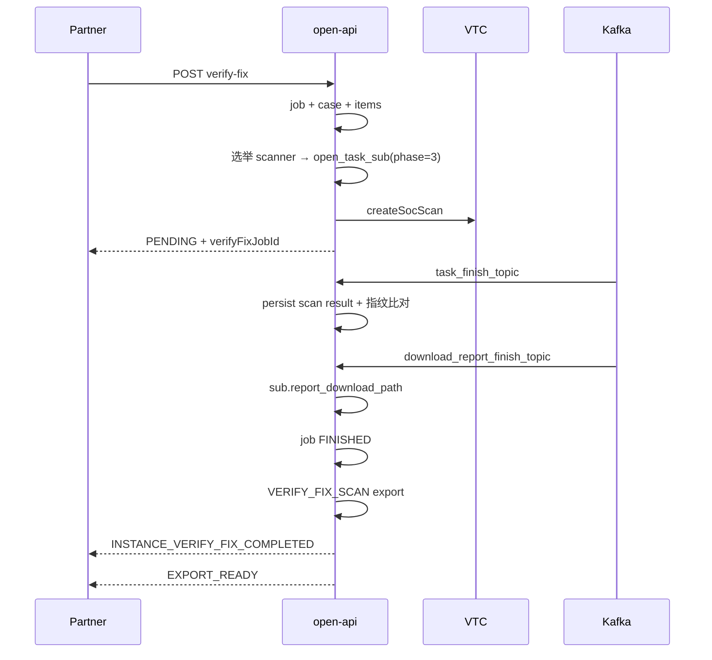
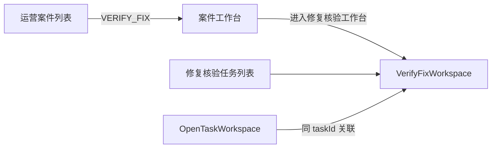

# 修复核验运营工作台 · PRD

> **版本**：v0.1（待确认）  
> **日期**：2026-06-18  
> **状态**：草案 · 待产品/研发确认  
> **基线文档**：
> - `svmp/docs/internal/1. 当前缺口：修复核验没接报告回调.md`（技术方案确认稿）
> - `svmp/docs/external/网络安全漏洞管理平台 · API 接口文档.md` §5.5 / §5.6
> - `svmp/docs/internal/开放平台运营案件-open_operation_case-方案.md`
> **对标实现**：`OpenTaskList` + `OpenTaskWorkspace`（OPEN 编排任务）

---

## 1. 背景与问题

### 1.1 业务背景

Partner 对 **已修复（stat=5）** 的漏洞实例发起 `verify-fix` 后，平台应：

1. 按实例**最近一次排查/扫描使用的扫描器**自动选举并下发 VTC 复扫；
2. 复扫完成后指纹比对，将实例推进 **6（核验修复）/ 7（核验未修复）/ 10（核验失败）**；
3. 通过 Webhook `INSTANCE_VERIFY_FIX_COMPLETED` 通知 Partner；
4. 产生结构化外发 `EXPORT_READY`（`exportStage=VERIFY_FIX_SCAN`）及扫描器原始报告路径（`report_download_path`）。

### 1.2 当前痛点

| 现象 | 根因 |
|------|------|
| 修复核验无法像 OPEN 编排任务一样运营跟踪 | 缺少 **job 维度一等公民工作台** |
| 报告回调链路曾断开 | 旧实现用 `VFS-` 前缀，`download_report_finish_topic` 被 skip |
| 运营 UI 误挂在「漏洞处置」页 | `VerifyFixOps` 定位为 **Partner API 联调**，非运营主入口 |
| 外发 `VERIFY_FIX_SCAN` 未闭环 | `assembleForVerifyFixScan` 无调用；取数 phase 配置错误 |
| 运营案件 VERIFY_FIX 载荷过薄 | 未嵌入完整 `VerifyFixWorkspace` 投影 |

### 1.3 产品目标

1. **执行面**：修复核验 VTC 复扫 **100% 复用** `open_task_sub`，`scan_phase=3`，双 Kafka 与创建任务一致。
2. **业务面**：`open_verify_fix_job` / `_item` 承载受理、批次、逐实例终态、案件关联。
3. **运营面**：提供 **修复核验任务列表 + 工作台**，体验对齐 `OpenTaskWorkspace`。
4. **Partner 面**：行为符合外部 API 文档 §5.5，不破坏现有 Open API 契约。

### 1.4 非目标（本期不做）

- 不新建 `open_verify_fix_job_sub` 表；
- 不废弃 `open_verify_fix_job`；
- 不把运营能力继续堆在 `VerifyFixOps`（漏洞处置）；
- 不改造 vul-pass 侧重扫引擎（open-api 侧闭环）；
- Mock 模式 XML 人工导入能力保留，但不作为 task-center 主路径。

---

## 2. 用户与场景

| 角色 | 场景 |
|------|------|
| **Partner 系统** | 调用 `verify-fix` / `verify-fix:batch`，收 Webhook + 下载外发 |
| **平台运营** | 查看修复核验 job 列表、子任务进度、报告路径、逐项 6/7/10 |
| **平台运营** | 从运营案件 `VERIFY_FIX` 跳入完整工作台 |
| **研发联调** | 在「漏洞处置」页单独测 verify / remediate / verify-fix API |

---

## 3. 概念模型

```
Partner verify-fix 请求
    → open_operation_case (VERIFY_FIX, RUNNING)
    → open_verify_fix_job + open_verify_fix_job_item
    → 扫描器选举 (open_vuln_instance_log.sub_id → open_task_sub.scanner_type)
    → 按 (taskId, scanner_type) 分组
    → open_task_sub (scan_phase=3, SUB-xxx) × N
    → VTC createSocScan (extTaskId=OPEN-{subId})

Kafka task_finish_topic
    → phase=3：更新 sub → fetchAll → 指纹比对 → item 终态
    → 全部 sub + item 终态 → job FINISHED → Webhook

Kafka download_report_finish_topic
    → sub.report_download_path = event.downloadPath

job FINISHED
    → assembleForVerifyFixScan (exportStage=VERIFY_FIX_SCAN)
    → EXPORT_READY Webhook
```

### 3.1 数据分工

| 实体 | 职责 |
|------|------|
| `open_verify_fix_job` | 业务聚合：jobId、partner、status、progress、caseId |
| `open_verify_fix_job_item` | 逐实例：vulInfoId、taskId、previousStat、resultStat、itemStatus、sourceSubId、scannerType、rescanSubId |
| `open_task_sub` | VTC 执行：下发、Kafka、轮询、`report_download_path`；`scan_phase=3`，`verify_fix_job_id` |
| `open_task` | 锚定原排查任务（`item.taskId`） |
| `open_operation_case` | 运营统一句柄；`primary_resource_id = jobId` |

### 3.2 scan_phase 行为矩阵

| scan_phase | 名称 | task_finish 后 | download_report_finish |
|------------|------|----------------|------------------------|
| 1 | 排查 | ingest + 实例落库 | 写 `report_download_path` |
| 2 | 验证 | 推进 open_task 编排 | 写 `report_download_path` |
| **3** | **修复核验** | **指纹比对 + 跃迁（不 ingest）** | **写 `report_download_path`** |

---

## 4. Partner API（不变更契约）

### 4.1 受理

- `POST /api/open/v1/instances/{vulInfoID}/verify-fix`
- `POST /api/open/v1/instances/verify-fix:batch`
- 前置：`vulInfoStat = 5`
- 受理响应：`verifyFixStatus=PENDING`，`verifyFixJobId`；受理期间 **保持 stat=5**

### 4.2 完成通知

- Webhook：`INSTANCE_VERIFY_FIX_COMPLETED`
- Payload 含各实例 `vulInfoStat` 终态（6/7/10）

### 4.3 外发

- Webhook：`EXPORT_READY`
- `exportStage = VERIFY_FIX_SCAN`
- 内容须含 `targets[]`、`liveProbeResults[]`、`portScanResults[]`、`vulnerabilities[]`（§5.6.3）
- 与 `TASK_COMPLETED` / `VERIFY_SCAN` 共用外发组装框架

### 4.4 扫描器选举规则

1. 查实例最近一次 `open_vuln_instance_log`，取 `sub_id`；
2. 读对应 `open_task_sub.scanner_type`；
3. 选举失败 → `job_item.itemStatus=FAILED`，记录原因，不阻塞同 job 其他 item；
4. 无 log / 无 sub_id 的实例 **无法自动下发**（运营可见失败原因）。

### 4.5 分组下发规则

- 分组键：`(taskId, scanner_type)`
- 每组 1 条 `open_task_sub(phase=3)`
- 组内实例共享同一 `rescan_sub_id`
- 跨 taskId 的 batch 产生多组 sub

---

## 5. 后端需求（open-api-service）

### 5.1 已完成（保留，作为基线）

| 项 | 说明 |
|----|------|
| `PHASE_VERIFY_FIX = 3` | `TaskCenterSubSupport` |
| 按组创建 `open_task_sub` | `TaskCenterVerifyFixOrchestrator` |
| `task_finish` phase=3 分支 | `TaskCenterKafkaRecycleService` |
| `download_report_finish` 写路径 | `TaskCenterReportRecycleService`（已去 VFS skip） |
| DB 扩展 | `verify_fix_job_id`、`item.source_sub_id/scanner_type/rescan_sub_id` |
| 指纹比对终态 | `VerifyFixJobDomainService.completeFromRescanCompareForSub` |
| 运营案件 rescanSubs | `OperationCaseWorkspaceAssembler` |

### 5.2 待完成（本期 PRD 范围）

#### B1. 双 Kafka 闭环补强

| ID | 需求 | 验收 |
|----|------|------|
| B1-1 | phase=3 子任务完成时，将 VTC 扫描结果 **persist 到 `open_task_scan_result`**（按 subId，**不 ingest 实例**） | 工作台可查看复扫漏洞明细；外发有数据 |
| B1-2 | `tryFinalizeVerifyFixJob` 成功时调用 `assembleForVerifyFixScan` | job FINISHED 后产生 `VERIFY_FIX_SCAN` export |
| B1-3 | 修正 `resolveScanPhase(VERIFY_FIX_SCAN)` → **phase=3**（非 phase=2） | 外发取数为复扫结果 |
| B1-4 | 避免 Webhook 重复：`assembleForVerifyFixScan` 内嵌的 publish 与 job 终态 publish 去重 | 仅 1 次 `INSTANCE_VERIFY_FIX_COMPLETED` |
| B1-5 | （可选）清理 `VFS-` legacy 分支，或文档标注仅兼容历史数据 | 新 job 不再产生 VFS- |

#### B2. 修复核验 Admin API

| 方法 | 路径 | 说明 |
|------|------|------|
| GET | `/internal/admin/verify-fix/jobs` | 列表：partnerId、status、taskId、jobId、分页 |
| GET | `/internal/admin/verify-fix/jobs/{jobId}/workspace` | 工作台聚合 |
| GET | `/internal/admin/verify-fix/pending-instances` | **保留**；作为列表「进行中」筛选数据源，非主 UI |

**`VerifyFixWorkspaceDto` 字段（建议）**：

```text
job                 // job 头：jobId, partnerId, status, progress, caseId, createdAt...
rescanSubs          // open_task_sub(phase=3)，含 reportDownloadPath
items               // job_item 全量 + 枚举翻译字段
itemStatCounts      // PENDING/DONE/FAILED → count
itemResultCounts    // 6/7/10 → count
relatedTaskIds      // 关联 open_task 摘要（可多个）
webhookDeliveries   // INSTANCE_VERIFY_FIX_COMPLETED + EXPORT_READY
timeline            // 受理 / 下发 / sub 完成 / job 完成
exports             // VERIFY_FIX_SCAN 外发摘要（exportId, format, status, downloadUrl）
constraints         // 选举规则、前置 stat=5 等（展示用）
```

#### B3. 运营案件投影

- `OperationCaseVerifyFixPayloadDto` 增加 `verifyFixWorkspace`（对称 `taskWorkspace`）
- `VerifyFixCasePanel` 改为：**摘要 +「进入修复核验工作台」**，不再承载完整运营

#### B4. DTO 补齐

- `OpenTaskSubDto` 增加 `reportDownloadPath`、`verifyFixJobId`
- 子任务 DTO 在各 Admin 转换层统一带出

---

## 6. 前端需求（asset-openplatform-manage）

### 6.1 信息架构

```
运营中心
  ├── 运营案件（已有）
  ├── OPEN 编排任务（已有）
  └── 修复核验任务（新增）          ← 本期
        ├── 任务列表 VerifyFixJobList
        └── 工作台 VerifyFixWorkspace

联调工具
  └── 漏洞处置 VerifyFixOps（瘦身）  ← 仅 API 测试
```

### 6.2 页面：修复核验任务列表 `VerifyFixJobList`

**对标**：`OpenTaskList.vue`

| 筛选项 | 说明 |
|--------|------|
| partnerId | 接入方 |
| jobId | VF-xxx |
| taskId | 关联 open_task |
| status | PENDING / RUNNING / FINISHED / FAILED |

| 列 | 说明 |
|----|------|
| jobId | 跳转工作台 |
| caseId | 跳转运营案件 |
| partnerId | |
| status | 枚举 Tag |
| itemCount | |
| progress | |
| 复扫 sub 数 | rescanSubs.length |
| createdAt | |

### 6.3 页面：修复核验工作台 `VerifyFixWorkspace`

**对标**：`OpenTaskWorkspace.vue`（单阶段版）

**顶栏**：jobId · status · progress · partner · caseId · 刷新

**阶段条**（仅一阶段）：

> **修复核验 · scan_phase=3**  
> 复扫子任务 N 个 · 待核验/已完成 M 条 · 约束说明（stat=5、扫描器选举）

**Tab 结构**：

| Tab | 内容 |
|-----|------|
| 概览 | 时序 timeline、约束 alert、item 结果分布 |
| 复扫子任务 | `SubTaskTable` 复用；列含 scanner、status、progress、surveyId、planId、**reportDownloadPath** |
| 待核验实例 | job items：vulInfoId、taskId、scanner、rescanSubId、itemStatus、前状态/结果 |
| 复扫结果 | 按 sub 查看漏洞/端口/存活（复用排查结果 Tab 组件，数据源 phase=3） |
| 外发与回调 | VERIFY_FIX_SCAN exports + Webhook 投递表 |
| Mock 专用 | XML 导入完成（`adapter-mode=mock` 时显示） |

**快捷入口**：

- 跳转关联 `OpenTaskWorkspace`（按 taskId）
- 跳转运营案件（caseId）

### 6.4 页面：漏洞处置 `VerifyFixOps`（瘦身）

**保留**：

- Partner 会话
- 实例列表 + 勾选
- Tab：验证 / 处置 / 修复核验（调 Open API）

**移除**（迁至工作台）：

- 「待修复核验」运营卡片
- Mock 内部作业面板（迁至工作台 Mock Tab 或保留在 E2E 控制台）

### 6.5 路由与菜单

| 路由 | name | 组件 |
|------|------|------|
| `/verify-fix-jobs` | `VerifyFixJobList` | 列表 |
| `/verify-fix-jobs/:jobId` | `VerifyFixWorkspace` | 工作台 |

- `Overview.vue`：新增「修复核验任务」入口
- `OperationCaseWorkspace`：VERIFY_FIX 增加「修复核验工作台」按钮
- 原 `/verify-fix-ops` 保留，描述改为「漏洞处置 API 联调」

---

## 7. 关键流程

### 7.1 单条 verify-fix（task-center）



### 7.2 运营查看路径



---

## 8. 约束与规则

| 规则 | 说明 |
|------|------|
| 前置状态 | 仅 `vulInfoStat=5` 可受理 |
| 受理期间 | 保持 stat=5，直至复扫比对完成 |
| 扫描器 | 默认取最近 log 对应 sub 的 scanner_type |
| 子任务 ID | 统一 `SUB-` 前缀，禁止新造 `VFS-` |
| 跨 task batch | 多组 `(taskId, scanner_type)`，每组独立 sub |
| 选举失败 | item → FAILED，job 可 PARTIAL_FAILED / FAILED |
| 幂等 | 沿用 Open API Idempotency-Key |
| 权限 | internal admin + Partner JWT（Open API 路径不变） |

---

## 9. 验收标准

### 9.1 后端 / 联调

- [ ] verify-fix 受理后 30s 内可在运营案件查到 `case_id`
- [ ] `open_task_sub` 出现 `scan_phase=3`、`verify_fix_job_id`，`sub_id` 为 `SUB-`
- [ ] `task_finish_topic` 触发后 item 正确跃迁 6/7/10
- [ ] `download_report_finish_topic` 写入 `report_download_path`（可在 workspace 看到）
- [ ] job FINISHED 后产生 `VERIFY_FIX_SCAN` export（json/xml 按模板）
- [ ] Partner 收到 `INSTANCE_VERIFY_FIX_COMPLETED` + `EXPORT_READY` 各 1 次
- [ ] 选举失败实例在 items 中可见 FAILED 及原因

### 9.2 前端

- [ ] 修复核验任务列表可筛选、可进工作台
- [ ] 工作台展示：复扫子任务、报告路径、逐项结果、外发、Webhook
- [ ] 运营案件 VERIFY_FIX 可一键进工作台
- [ ] 漏洞处置页无运营向「待核验」主卡片
- [ ] `npm run build` 通过

### 9.3 回归

- [ ] OPEN 编排 task phase 1/2 不受 phase=3 影响
- [ ] Mock 模式 XML 导入路径仍可用（E2E mock flow）

---

## 10. 实施分期

| 阶段 | 范围 | 产出 |
|------|------|------|
| **P0** | B1 双 Kafka + 外发闭环 | 后端可 E2E 验收 §9.1 |
| **P1** | B2 workspace API + B3 案件投影 | Admin API + 案件载荷 |
| **P2** | F2 列表 + 工作台 + F1 瘦身 VerifyFixOps | 前端可运营 |
| **P3** | 清理 VFS legacy、文档/联调手册更新 | 技术债 |

建议 **P0 → P1 → P2** 顺序；P0 未完成前不宣称「报告回调已接通」。

---

## 11. 风险与决策点（待你确认）

| # | 决策点 | 建议 | 备选 |
|---|--------|------|------|
| D1 | phase=3 完成是否 persist 扫描结果到 `open_task_scan_result` | **是**（与外发、工作台查结果一致） | 外发时临时 fetch VTC，不落库 |
| D2 | 一个 job 跨多个 taskId 时，`VERIFY_FIX_SCAN` export 按哪个 taskId | **按 item 主 taskId 分组各出一份**，或 **job 级只出一份合并 export** | 需产品定 |
| D3 | `assembleForVerifyFixScan` 触发时机 | **job 全部 item 终态后一次** | 每个 sub 完成各触发（易重复） |
| D4 | Mock 作业 UI 放哪 | **VerifyFixWorkspace 的 Mock Tab** | 保留在 MockE2eConsole |
| D5 | `pending-instances` API | **保留**，供列表「进行中」筛选 | 合并进 workspace 查询参数 |
| D6 | `open_verify_fix_job.center_sub_id` 等冗余字段 | 本期标注废弃，以 sub 为准 | 本期物理删列（风险大） |

---

## 12. 与现状差异说明（纠错记录）

| 原错误做法 | PRD 正确做法 |
|------------|--------------|
| 在 `VerifyFixOps` 做运营主界面 | 独立 `VerifyFixJobList` + `VerifyFixWorkspace` |
| 以为删掉 VFS skip = 报告回调完成 | 还需外发触发、phase=3 取数、persist 结果 |
| `pending-instances` 当主产品 | 工作台的一等视图，列表为 job 维度 |
| 运营案件内做大表 | 嵌入 `verifyFixWorkspace` 投影 + 跳转完整工作台 |

---

## 13. 确认项

请确认以下勾选后回复「同意执行」或标注修改意见：

- [ ] **产品范围**：§1.3 目标 + §1.4 非目标
- [ ] **数据模型**：§3 复用 `open_task_sub(phase=3)`，不建 job_sub
- [ ] **Partner 契约**：§4 与外部 API 文档一致
- [ ] **后端缺口**：§5.2 B1–B4
- [ ] **前端 IA**：§6 列表 + 工作台，VerifyFixOps 瘦身
- [ ] **验收标准**：§9
- [ ] **决策点**：§11 D1–D6（尤其 D2 export 粒度）

---

*文档维护：确认后升版 v1.0，作为开发与验收唯一基线。*
