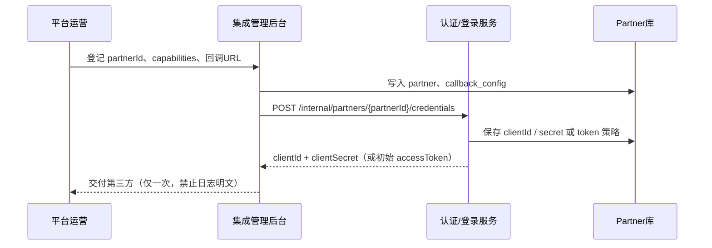
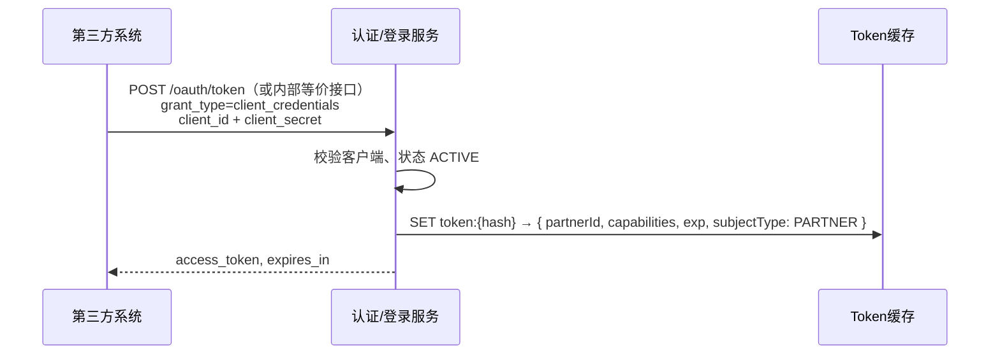
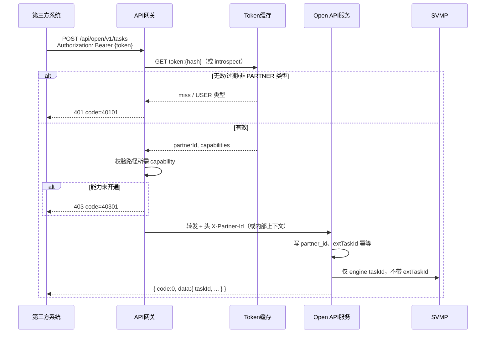
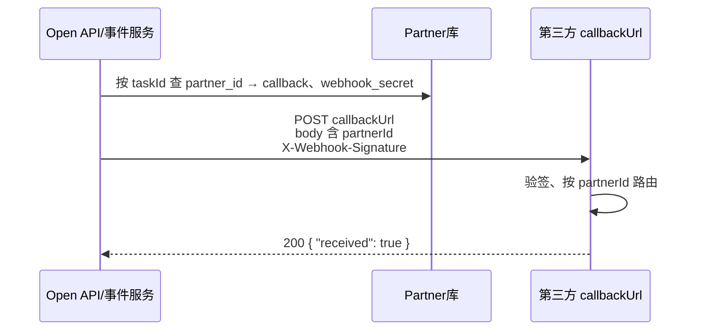

# 开放平台 Partner 鉴权与隔离 · 落地方案

> **适用前提**：Token 在**用户/认证登录服务**生成并写入缓存；**网关只校验、不签发**。  
> **目标**：在现有 `Authorization` 能力上，补齐 `partnerId` 解析、`capabilities` 与数据隔离，**无需**单独采购对外网关，**二期**再支持 `X-Api-Key` + HMAC。

**相关文档**：[对外集成能力设计方案](./漏洞管理平台对外集成能力设计方案-V2.0.md) §四、§五 · [第三方接口规范](../external/开放平台API接口规范.md) §2–§3

---

## 1. 组件职责

| 组件 | 职责 | 不负责 |
|------|------|--------|
| **认证/登录服务** | Partner 客户端注册；签发/刷新 Partner Token；缓存 `token → partner 上下文`；吊销 | 开放平台业务、SVMP 调用 |
| **API 网关** | TLS、基础限流；校验 `Authorization`；解析 `partnerId` 写入请求上下文；可选 capabilities 拦截 | 生成 Token、业务状态机 |
| **Open API 服务**（或集成域服务） | `/api/open/v1/*` 实现；`partner_id` 数据隔离；`extTaskId` 幂等；调 SVMP 适配层 | 用户门户登录 UI |
| **SVMP 执行层** | 扫描/处置执行 | Partner 直连 |

---

## 2. 总体时序（机机 Token · 推荐）

### 2.1 Partner 开通（一次性）



### 2.2 第三方获取 Token



> 若暂不实现标准 OAuth，可用 **`POST /internal/partners/token`**（见 §4.2）由登录服务直接发 Partner 专用 Token，原则相同。

### 2.3 调用开放平台 API



### 2.4 Webhook 出站（平台 → Partner）



---

## 3. Token 缓存结构（登录服务写入）

建议与普通**用户登录 Token 分键、分类型**，避免混用。

```json
{
  "subjectType": "PARTNER",
  "partnerId": "partner-siem-01",
  "capabilities": [
    "TASK_WRITE",
    "TASK_READ",
    "INSTANCE_READ",
    "EXPORT_READ",
    "EVENT_SUBSCRIBE"
  ],
  "clientId": "cli_abc123",
  "issuedAt": 1747785600,
  "expiresAt": 1747872000
}
```

| 字段 | 说明 |
|------|------|
| `subjectType` | 固定 `PARTNER`；网关见 `USER` 则拒绝访问 `/api/open/v1/*`（或走别的 API） |
| `partnerId` | 平台分配接入方 ID |
| `capabilities` | 开通能力码列表，与 [接口规范 §8](../external/开放平台API接口规范.md) 一致 |
| `clientId` | 可选，审计用 |

**缓存键示例**：`token:sha256(access_token)` 或 `session:{jti}`。

**TTL**：与 `expires_in` 一致；刷新 Token 时轮换缓存键。

---

## 4. 接口清单

### 4.1 认证/登录服务（新增 · 内部/运营）

| 方法 | 路径 | 调用方 | 说明 |
|------|------|--------|------|
| POST | `/internal/partners` | 集成管理后台 | 创建 Partner（partnerId、名称、capabilities、默认 callback） |
| PUT | `/internal/partners/{partnerId}` | 管理后台 | 更新状态、capabilities、回调 |
| POST | `/internal/partners/{partnerId}/credentials` | 管理后台 | 创建/轮换 clientId+secret 或发长期 Token |
| DELETE | `/internal/partners/{partnerId}/credentials/{credentialId}` | 管理后台 | 吊销凭证 |
| POST | `/oauth/token` 或 `/internal/partners/token` | 第三方 | `client_credentials` 换 access_token |
| POST | `/internal/token/introspect` | **网关** | 入参 token，返回上述缓存结构（若网关不直连 Redis） |
| DELETE | `/internal/partners/{partnerId}/sessions` | 管理后台 | 强制下线该 Partner 全部 Token |

**`POST /internal/partners/token` 请求示例（简化版 OAuth）**

```json
{
  "grantType": "client_credentials",
  "clientId": "cli_abc123",
  "clientSecret": "***"
}
```

**响应**

```json
{
  "accessToken": "eyJ...",
  "tokenType": "Bearer",
  "expiresIn": 86400,
  "partnerId": "partner-siem-01"
}
```

> 若用 JWT：在 claims 中写入 `sub=partner-siem-01`、`typ=partner`、`capabilities` 数组；网关可本地验签 JWT，**仍建议**与 Redis 吊销列表配合。

---

### 4.2 API 网关（改造 · 无新对外路径）

在现有 `Authorization` 校验通过后增加：

| 步骤 | 动作 |
|------|------|
| G1 | 仅对路径前缀 `/api/open/v1` 启用 Partner 逻辑 |
| G2 | 从缓存 / introspect 读取 `subjectType`、`partnerId`、`capabilities` |
| G3 | `subjectType != PARTNER` → 40101 |
| G4 | 查表「路径 + 方法 → 所需 capability」（见下表） |
| G5 | 未包含 → 40301 |
| G6 | 向下游注入 `X-Partner-Id: {partnerId}`（或 gRPC metadata / ThreadLocal） |
| G7 | 可选：按 partnerId 限流（QPS 来自 Partner 表 `rateLimit`） |

**路径 → 能力码映射（与 OpenAPI 一致）**

| 方法 | 路径模式 | capability |
|------|----------|------------|
| POST | `/api/open/v1/tasks` | TASK_WRITE |
| GET | `/api/open/v1/tasks` | TASK_READ |
| GET | `/api/open/v1/tasks/*` | TASK_READ |
| POST | `/api/open/v1/instances/search` | INSTANCE_READ |
| GET | `/api/open/v1/instances/*` | INSTANCE_READ |
| POST | `/api/open/v1/instances/*/verify` | INSTANCE_VERIFY |
| POST | `/api/open/v1/instances/verify:batch` | INSTANCE_VERIFY |
| POST | `/api/open/v1/instances/*/remediate` | INSTANCE_REMEDIATE |
| POST | `/api/open/v1/instances/*/archive` | INSTANCE_ARCHIVE |
| POST | `/api/open/v1/instances/*/verify-fix` | INSTANCE_VERIFY_FIX |
| POST | `/api/open/v1/instances/verify-fix:batch` | INSTANCE_VERIFY_FIX |
| GET | `/api/open/v1/exports/*` | EXPORT_READ |
| GET | `/api/open/v1/tasks/*/exports` | EXPORT_READ |

---

### 4.3 Open API / 集成域服务（业务改造）

| 项 | 要求 |
|----|------|
| 上下文 | 从 `X-Partner-Id` 读取，**禁止**信任请求 body/query 中的 partnerId |
| 创建任务 | 表 `open_task` 增加 `partner_id`；唯一索引 `(partner_id, ext_task_id)` |
| 查任务/实例 | 所有 SQL 带 `partner_id = :ctx` |
| 实例写 | 校验 `vulInfoID` 属于该 Partner 可见集合 |
| 错误码 | 与 [接口规范 §9](../external/开放平台API接口规范.md) 一致 |

**内部可选接口（供网关 introspect 失败时降级）**

| 方法 | 路径 | 说明 |
|------|------|------|
| GET | `/internal/context/partner` | 仅集群内，头带 Authorization，返回 partnerId（一般由网关完成） |

---

## 5. 数据表（最小集）

```sql
-- Partner 主数据
CREATE TABLE partner (
  partner_id        VARCHAR(64) PRIMARY KEY,
  partner_name      VARCHAR(256) NOT NULL,
  partner_type      VARCHAR(32),
  status            VARCHAR(16) NOT NULL DEFAULT 'ACTIVE',
  default_callback_url VARCHAR(1024),
  rate_limit_qps    INT,
  created_at        TIMESTAMP,
  updated_at        TIMESTAMP
);

-- 能力（或 JSON 存 partner 表）
CREATE TABLE partner_capability (
  partner_id        VARCHAR(64),
  capability        VARCHAR(64),
  PRIMARY KEY (partner_id, capability)
);

-- 凭证（登录服务也有一份映射时可同步）
CREATE TABLE partner_credential (
  credential_id     VARCHAR(64) PRIMARY KEY,
  partner_id        VARCHAR(64) NOT NULL,
  client_id         VARCHAR(128) UNIQUE NOT NULL,
  client_secret_hash VARCHAR(256) NOT NULL,
  status            VARCHAR(16) DEFAULT 'ACTIVE',
  created_at        TIMESTAMP
);

-- 任务幂等
CREATE TABLE partner_task_map (
  partner_id        VARCHAR(64) NOT NULL,
  ext_task_id       VARCHAR(128) NOT NULL,
  platform_task_id  VARCHAR(64) NOT NULL,
  created_at        TIMESTAMP,
  PRIMARY KEY (partner_id, ext_task_id)
);
```

业务表 `open_task`、`vuln_instance`（或等价）增加 **`partner_id`** 字段并建索引。

---

## 6. 与用户登录 Token 的隔离策略

| 策略 | 说明 |
|------|------|
| **分开发 Token 接口** | 用户：`/auth/login`；Partner：`/oauth/token` 或 `/internal/partners/token` |
| **缓存分前缀** | `user:token:*` vs `partner:token:*` |
| **网关路径分流** | `/api/open/v1/*` 仅接受 `subjectType=PARTNER` |
| **禁止** | 用普通运维账号 Token 调开放平台（除非明确做 B 方案：用户表绑 partner_id，仅内部试点） |

---

## 7. 分阶段实施

| 阶段 | 登录服务 | 网关 | Open API | 验收 |
|------|----------|------|----------|------|
| **P0** | Partner 表 + client_credentials 发 Token + 缓存带 partnerId | 校验 Token + 注入 X-Partner-Id | 任务/查询带 partner_id 隔离 | 两家试点 Partner 互不可见任务 |
| **P1** | 凭证轮换、吊销 API | capabilities 40301 | Webhook 带 partnerId + 验签 | 与接口规范 §6 对齐 |
| **P2** | 可选 API Key 凭证类型 | X-Api-Key + HMAC 校验 | 同 P1 | 满足不便 Bearer 的客户 |
| **P3** | IP 白名单、mTLS 配置下发 | 网关执行连接层策略 | — | 高安全客户 |

---

## 8. 检查清单（上线前）

- [ ] 第三方仅持有 Partner `clientId/secret` 或专用 Token，非门户用户密码
- [ ] 缓存/introspect 必含 `partnerId`、`subjectType=PARTNER`
- [ ] `/api/open/v1` 不接收 body/query 中的 partnerId 作为鉴权依据
- [ ] `extTaskId` 唯一约束为 `(partner_id, ext_task_id)`
- [ ] 跨 Partner 访问他人 `taskId` / `vulInfoID` 返回 40003
- [ ] 网关与业务日志打印 `partnerId`、`requestId`，不打印 secret
- [ ] Webhook 使用 Partner 级 `webhook_secret`，与入站 client_secret 分离

---

## 9. 与「平台网关」关系（再说明）

```text
第三方 → [现有平台网关] Authorization 校验（查登录服务缓存）
              → Partner 解析 + capability（本方案 §4.2）
              → Open API 服务（partner_id 隔离）
              → SVMP
```

**不需要**替换现有平台网关，也**不需要**在网关生成 Token；登录服务补 Partner 发 Token 与缓存字段即可串联全链路。
