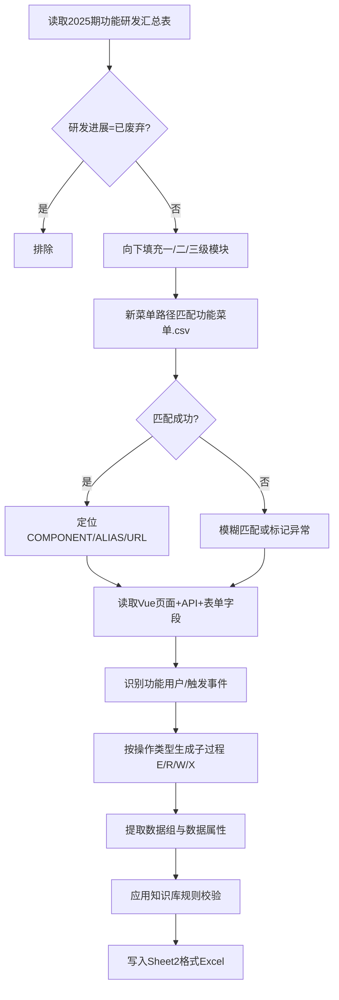

## 提示词分析与确认

我已阅读四个输入文件并做了初步数据统计，你的需求方向**清晰且可执行**，核心链路是：

```text
功能清单(文件1) → 菜单匹配(文件4) → 前端源码分析 → COSMIC拆分(文件2模板) → 规避评估风险(文件3)
```

下面是我对提示词的**理解确认**、**需你拍板的异议点**，以及**PRD 方案草案**。

---

## 一、我对需求的理解（确认版）

| 维度         | 理解                                                         |
| ------------ | ------------------------------------------------------------ |
| **功能范围** | 文件1 `2025期功能研发汇总表`，排除「研发进展=已废弃」        |
| **层级字段** | OPEX需求名称/CAPEX子系统、一/二/三级模块、功能过程 — 直接继承文件1 |
| **新增字段** | 功能用户、触发事件、子过程描述、数据移动类型(E/R/W/X)、数据组、数据属性 — 按文件2 Sheet2 规范生成 |
| **溯源依据** | 用「新菜单路径(v3.8.3)」匹配文件4菜单 → 定位前端 Vue/JS/API → 从代码推断数据流 |
| **质量约束** | 严格遵循文件2填写说明 + 文件3前评估经验，规避重复、标黄、标红等常见问题 |
| **最终交付** | 符合 Sheet2 列结构的 COSMIC 功能拆分表（Excel）              |

**数据统计（已核实）：**

- 总行数：**572**
- 排除已废弃后：**498** 条有效功能过程
- 研发进展分布：联调完成 479 / 待优化 11 / 未开始 5 / 开发中 3
- 唯一菜单路径：**66** 条
- 无菜单路径：**12** 条
- 菜单名不完全一致（如「运营·深耕」vs CSV 中可能不同）：约 **18** 条需人工/模糊匹配

---

## 二、需你确认的 6 个异议点

### 1. 功能范围：是否只排除「已废弃」？

当前 498 条包含：
- **未开始 5**、**开发中 3** — 可能尚无前端代码
- **待优化 11** — 功能存在但可能不完整

**建议默认**：仅排除「已废弃」；对「未开始/开发中」标记为「待补代码映射」，不强行编造子过程。  
**请确认**：是否同意？还是连「未开始/开发中」也排除？

---

### 2. 菜单匹配规则：精确 vs 模糊

文件1 菜单路径示例：
- `漏洞生命周期管理/产品漏洞管理/CPE文档管理` ✅ 可精确匹配
- `运营·深耕/弱口令与扫描管理/扫描任务管理/弱口令扫描` ⚠️ CSV 中可能无「运营·深耕」前缀或层级不同

**建议匹配策略（优先级）**：
1. 全路径精确匹配（按 NAME 链拼接）
2. 末级菜单名 + 父级链模糊匹配
3. 用 `ALIAS` / `URL` / `COMPONENT` 反查
4. 仍无法匹配 → 人工清单

**请确认**：是否接受模糊匹配？匹配不到时是否允许跳过并汇总「待人工处理清单」？

---

### 3. 无 UI 的功能如何处理？

部分功能操作为：
- `程序内部自动执行`
- 纯后端接口（文件1 有「测试数据交互」等无明确页面路径）

**建议**：
- 有菜单 → 优先从前端 + API 分析
- 无菜单但标注内部执行 → 从后端 Controller/DTO 推断，功能用户写「发起者：系统模块；接收者：数据库/外部系统」
- 完全无代码 → 不生成 COSMIC 行，列入异常清单

**请确认**：是否允许分析后端代码？还是**仅前端**？

---

### 4. 列表查询 vs 详情查询 — 评估红线

文件3 明确：**同一实体的「列表查看」和「查看详情」不能重复计点**，后评估会抽检按钮是否存在。

**建议规则**：
- 文件1 同时有「XXX查询」和「XXX详情查询」→ 合并为一个功能过程，或只保留一个并改描述
- 子过程描述必须体现**独立 UI 操作**（如行内「详情」按钮、独立详情页）

**请确认**：遇到重复查询类功能时，是**合并**还是**保留其一并删另一**？

---

### 5. 交付物范围：仅功能拆分表，还是含时序图？

文件2 Sheet1 要求：
- 附件5 必含「**功能时序图**」+「**功能拆分表**」
- 建议至少每个三级模块提供一个时序图

**请确认**：
- [ ] 仅 Sheet2 功能拆分表
- [ ] 拆分表 + 时序图（按三级模块）
- [ ] 完整附件5（含代码-功能映射清单等，见文件3第21条）

---

### 6. 人天/功能点上限

文件3：设计院默认 **1 功能点 ≈ 1.2 人天**；1000 人天项目功能点不宜超过约 833（可试 900）。

**请确认**：本次 2025 期是否有**目标人天或 CFP 上限**？若无，我按「每条功能过程 3~5 个 CFP（E+R+W，不含末尾 X 提示）」估算，总量约 **1500~2500 CFP**，需你确认是否合理。

---

## 三、PRD — COSMIC 功能拆分自动化生成方案

### 1. 项目背景

漏洞管理平台 2025 期需提交 COSMIC 前后评估材料。功能清单已有 572 条功能过程定义，但 COSMIC 拆分表（功能用户、触发事件、子过程、数据移动等）需人工从代码反推，工作量大且易触评估红线。

**目标**：基于已交付功能清单 + 菜单库 + 前端源码，自动生成符合模板的 COSMIC 功能拆分表，并规避历史评估问题。

---

### 2. 输入与输出

#### 2.1 输入

| 文件                                                         | 用途                                                    |
| ------------------------------------------------------------ | ------------------------------------------------------- |
| `漏洞管理平台-2025期功能清单(Q).xlsx` → `2025期功能研发汇总表` | 功能范围、模块层级、功能过程、菜单路径                  |
| `COSMIC填写说明.xlsx` → Sheet2                               | 输出列结构与填写规范                                    |
| `COSMIC填写说明.xlsx` → Sheet1                               | 全局约束（A列空白、子过程在J列等）                      |
| `前后评估知识库.xlsx` → `前评估`                             | 规避规则与抽检要求                                      |
| `功能菜单.csv`                                               | 菜单 ID/NAME/URL/ALIAS/COMPONENT 映射                   |
| 前端源码                                                     | `project_frontend/asset/asset-*-manage/` 等微前端子应用 |

#### 2.2 输出

| 交付物                    | 说明                                  |
| ------------------------- | ------------------------------------- |
| **COSMIC功能拆分表.xlsx** | Sheet2 格式，14列（修订标识~CFP）     |
| **菜单-源码映射清单.csv** | 功能过程 → 菜单 → Vue 文件 → API 文件 |
| **异常待处理清单.csv**    | 无菜单/无代码/重复功能/需人工确认项   |
| **（可选）功能时序图**    | 按三级模块 Mermaid/Visio              |

---

### 3. 处理流程



---

### 4. 字段生成规则

| 列                                     | 生成规则                                                     |
| -------------------------------------- | ------------------------------------------------------------ |
| **OPEX/CAPEX/一二级三级模块/功能过程** | 直接从文件1继承（模块列 forward-fill）                       |
| **功能用户**                           | 默认「发起者：安全运营人员；接收者：漏洞管理平台」；导入/定时任务类改为「发起者：系统调度模块；接收者：数据库」 |
| **OPEX-功能用户需求**                  | 「主谓宾」：如「安全运营人员查询CPE文档信息」                |
| **触发事件**                           | 「操作+对象」：如「点击查询按钮」「提交CPE文档表单」         |
| **子过程描述**                         | 每个数据移动一行；谓宾结构；**不写**「第一步/第二步」        |
| **数据移动类型**                       | 查询：E(条件)+R(列表/详情)+X(展示)；新增/修改：E(表单)+W(持久化)+X(结果)；**末尾 X 提示成功与否尽量省略**（知识库第19条） |
| **数据组**                             | 实体名：如「CPE文档信息」「扫描任务信息」                    |
| **数据属性**                           | 从 Vue 表单字段、表格 columns、API request/response 提取，逗号分隔 |
| **CFP**                                | 每个子过程 = 1                                               |

---

### 5. 知识库强制规避清单

| 规则                                      | 来源           | 执行方式                     |
| ----------------------------------------- | -------------- | ---------------------------- |
| 一二三级目录与功能清单严格对应            | 文件3-11       | 直接映射，不擅自改模块名     |
| 增删改查分开写，不用「配置/管理」笼统描述 | 文件3-10       | 功能过程名保持文件1原文      |
| 同实体列表+详情不重复计点                 | 文件3-18       | 检测并合并或标记             |
| 子过程描述跨功能高度相似 → 判复用         | 文件3-18       | 差异化描述（写具体业务对象） |
| 末尾「提示成功与否」的 X 不认可           | 文件3-19       | 省略或合并到主 X             |
| Redis 缓存读写不计点                      | 文件3-19       | 只写 DB 持久化 W             |
| 静态判断不计功能点                        | 文件2 Sheet1-8 | 跳过纯校验逻辑               |
| 配置开源/已有功能不计点                   | 文件2 Sheet1-9 | 跳过                         |
| 删除 vs 批量删除需独立按钮                | 文件3-20       | 分别拆功能过程               |
| 功能必须有独立页面可演示                  | 文件3-20       | 映射不到 Vue 则标记异常      |

---

### 6. 源码分析范围

| 层级     | 路径                            | 用途                              |
| -------- | ------------------------------- | --------------------------------- |
| 路由     | `*/src/config/router.config.js` | 菜单 → 组件路径                   |
| 页面     | `*/src/views/**/*.vue`          | 按钮、表单、表格字段              |
| API      | `*/src/api/**/*.js`             | 请求/响应字段                     |
| 公共组件 | `v-components/`                 | Search、AssetTable 等复用组件字段 |

**匹配示例（已验证）**：
- 菜单 `CPE文档管理` → `asset-other-manage/src/views/QinghaiManage/CpeDocumentManage/CpeDocManage.vue`

---

### 7. 执行阶段

| 阶段                 | 内容                                  | 产出            |
| -------------------- | ------------------------------------- | --------------- |
| **P0 数据清洗**      | 过滤废弃、模块 forward-fill、菜单匹配 | 498条基础数据集 |
| **P1 菜单-源码映射** | 66个菜单路径 → Vue/API 文件           | 映射清单        |
| **P2 规则引擎**      | 按功能操作类型生成子过程模板          | 子过程草稿      |
| **P3 源码增强**      | 从代码提取真实数据属性                | 填充数据组/属性 |
| **P4 质量校验**      | 知识库规则扫描                        | 异常清单        |
| **P5 输出**          | 生成 Excel + 人工复核清单             | 最终交付物      |

---

### 8. 风险与应对

| 风险                    | 影响           | 应对                                        |
| ----------------------- | -------------- | ------------------------------------------- |
| 12条无菜单路径          | 无法定位代码   | 人工补路径或从「菜单/路径(完成必填)」列兜底 |
| 菜单命名不一致          | 匹配失败       | 建立别名映射表（运营·深耕 ↔ 实际菜单名）    |
| 未开始/开发中功能无代码 | 子过程不准确   | 标记「待开发」，不纳入最终提交版            |
| AI 生成属性不完整       | 评估标黄       | 人工抽检 + 源码字段优先                     |
| 功能点总量超标          | 不满足人天比例 | 按目标 CFP 上限反推，优先保留增删改查主流程 |

---

### 9. 验收标准

- [ ] 输出 Excel 列结构与 Sheet2 完全一致（14列，A列空白）
- [ ] 498 条功能过程（排除已废弃）均有对应行或异常说明
- [ ] 一/二/三级模块与文件1 100% 一致
- [ ] 每条功能过程至少 1 个 E + 1 个 R/W + 1 个 X（末位 X 按规则省略）
- [ ] 无「列表+详情」同实体重复计点（或已人工确认）
- [ ] 异常清单 ≤ 5%（约 25 条以内待人工）
- [ ] （可选）每个三级模块至少 1 张时序图

---

## 四、请你回复确认

请对以下 **4 项** 直接回复选项或补充说明，确认后我再进入执行（生成 COSMIC 表）：

1. **功能范围**：仅排除「已废弃」 / 同时排除「未开始+开发中」
2. **代码分析范围**：仅前端 / 前端 + 后端 API
3. **交付物**：仅功能拆分表 / 拆分表 + 时序图 / 完整附件5
4. **目标 CFP 或人天上限**：有具体数字请提供；无则按全量生成后你再裁剪

---

**总结**：你的提示词**逻辑完整、目标明确**，可落地。主要需确认的是**范围边界**（未开始/开发中是否纳入）、**菜单模糊匹配策略**、**是否含后端与时序图**、以及 **CFP 上限**。确认以上 4 点后，即可按 PRD 分阶段执行。